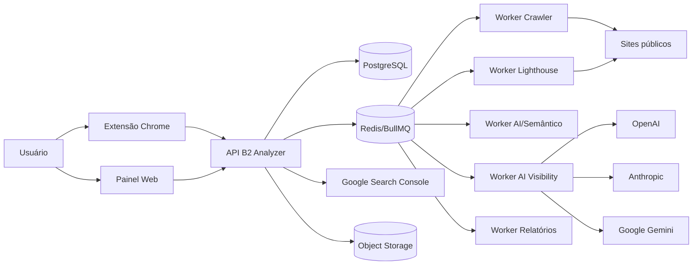
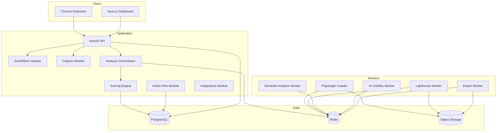
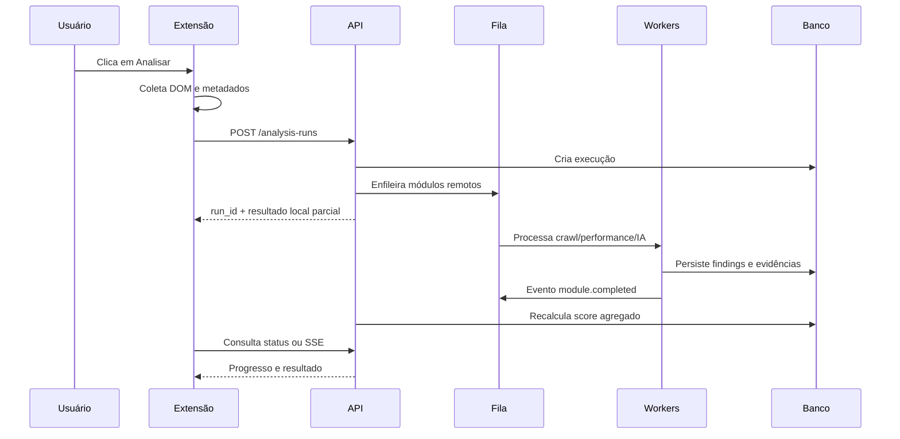
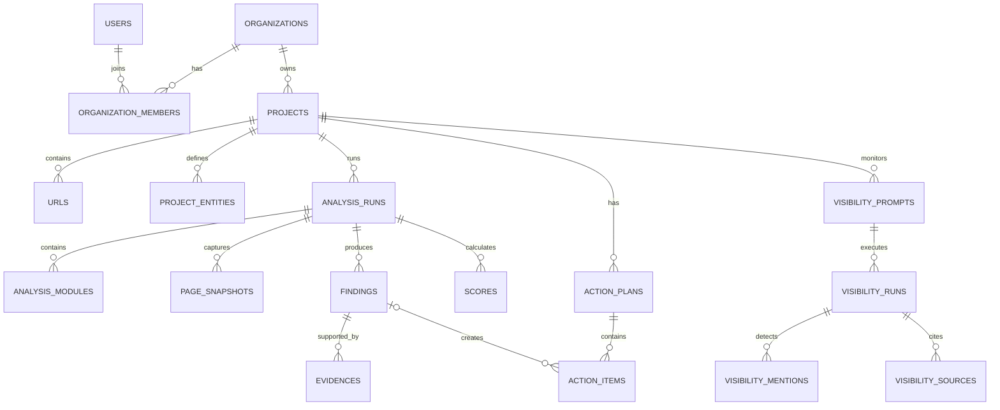

# B2 GEO/SEO Analyzer — Documentação Consolidada

**Versão 1.0 — 22 de julho de 2026**


---

<!-- Fonte: README.md -->

# B2 GEO/SEO Analyzer — Documentação do Produto

**Status:** Documento-base para início do desenvolvimento  
**Versão:** 1.0  
**Data:** 22 de julho de 2026  
**Nome de trabalho:** B2 GEO/SEO Analyzer  
**Responsável de negócio:** B2 Marketing Industrial

## 1. Visão geral

O B2 GEO/SEO Analyzer é uma plataforma SaaS composta por:

1. uma extensão para Google Chrome;
2. um painel web;
3. um backend de análise e rastreamento;
4. um motor de pontuação SEO e GEO;
5. um módulo de visibilidade em mecanismos de IA;
6. um gerador de plano de ação priorizado.

O produto avalia uma página ou um domínio e responde a quatro perguntas:

- A página está tecnicamente preparada para mecanismos de busca?
- A página está clara e estruturada para mecanismos generativos?
- A empresa possui sinais suficientes de autoridade e confiabilidade?
- Quais correções devem ser realizadas primeiro para aumentar a visibilidade?

## 2. Entregáveis principais

- **SEO Score:** 0 a 100.
- **GEO Readiness Score:** 0 a 100.
- **AI Visibility Score:** 0 a 100, quando o módulo estiver habilitado.
- **Digital Discoverability Score:** indicador consolidado opcional.
- **Overview da página:** itens corretos, alertas, falhas e limitações.
- **Evidências:** elemento, trecho, URL, cabeçalho ou resposta que originou cada diagnóstico.
- **Plano de ação:** tarefas organizadas por impacto, esforço, urgência e responsável sugerido.
- **Histórico:** evolução da pontuação e das correções.
- **Exportação:** PDF, CSV e integração futura com o B2 Hub.

## 3. Princípios do produto

1. **Explicabilidade:** nenhuma nota relevante deve existir sem critérios e evidências.
2. **Separação de escopo:** página, domínio, dados externos e testes em IA são camadas diferentes.
3. **Determinismo primeiro:** regras objetivas calculam a maior parte da nota.
4. **IA como avaliadora complementar:** modelos generativos não devem ser a única fonte de pontuação.
5. **Sem promessa de ranking:** a ferramenta mede preparação e visibilidade observada, não garantia de recomendação.
6. **Privacidade por padrão:** coletar apenas o necessário, com consentimento explícito para integrações.
7. **Arquitetura evolutiva:** começar com monólito modular e filas; separar serviços quando houver demanda real.
8. **Especialização industrial:** aplicações, normas, marcas, regiões, cases e evidências técnicas têm peso maior no contexto B2B industrial.

## 4. Índice da documentação

| Documento | Conteúdo |
|---|---|
| [01_PRD.md](01_PRD.md) | Visão de produto, personas, requisitos e métricas |
| [02_ESCOPO_E_REGRAS_DE_NEGOCIO.md](02_ESCOPO_E_REGRAS_DE_NEGOCIO.md) | Escopos de análise e regras funcionais |
| [03_ARQUITETURA.md](03_ARQUITETURA.md) | Arquitetura lógica, componentes e fluxos |
| [04_EXTENSAO_CHROME.md](04_EXTENSAO_CHROME.md) | Especificação da extensão Manifest V3 |
| [05_CRAWLER_E_ANALISADORES.md](05_CRAWLER_E_ANALISADORES.md) | Crawler, renderização e coletores |
| [06_MODELO_DE_PONTUACAO.md](06_MODELO_DE_PONTUACAO.md) | Fórmulas, pesos, confiança e severidade |
| [07_AI_VISIBILITY.md](07_AI_VISIBILITY.md) | Testes de recomendação em motores de IA |
| [08_MODELO_DE_DADOS.md](08_MODELO_DE_DADOS.md) | Entidades, relacionamentos e retenção |
| [09_API_E_INTEGRACOES.md](09_API_E_INTEGRACOES.md) | Contratos, endpoints e integrações |
| [10_UX_UI.md](10_UX_UI.md) | Fluxos, telas e componentes |
| [11_SEGURANCA_PRIVACIDADE_LGPD.md](11_SEGURANCA_PRIVACIDADE_LGPD.md) | Segurança, privacidade e LGPD |
| [12_TESTES_E_QUALIDADE.md](12_TESTES_E_QUALIDADE.md) | Estratégia de testes e critérios de aceite |
| [13_DEVOPS_OBSERVABILIDADE.md](13_DEVOPS_OBSERVABILIDADE.md) | Ambientes, deploy, logs e operação |
| [14_ROADMAP_BACKLOG.md](14_ROADMAP_BACKLOG.md) | MVP, fases, épicos e backlog inicial |
| [15_DECISOES_E_RISCOS.md](15_DECISOES_E_RISCOS.md) | ADRs, riscos e mitigação |
| [16_REFERENCIAS.md](16_REFERENCIAS.md) | Fontes oficiais e premissas técnicas |
| [17_GUIA_DE_INICIO_DESENVOLVIMENTO.md](17_GUIA_DE_INICIO_DESENVOLVIMENTO.md) | Passos práticos para iniciar o código |
| [api/openapi.yaml](api/openapi.yaml) | Especificação inicial da API |
| [database/schema.sql](database/schema.sql) | Esquema SQL inicial |
| [extension/manifest.example.json](extension/manifest.example.json) | Manifesto de referência |
| [scoring/rules.seed.json](scoring/rules.seed.json) | Exemplo de regras do motor de pontuação |
| [.env.example](.env.example) | Variáveis locais de referência |
| [docker-compose.example.yml](docker-compose.example.yml) | Serviços locais de desenvolvimento |

## 5. Stack recomendada

### Monorepo

- pnpm workspaces;
- Turborepo;
- TypeScript em todos os módulos JavaScript/Node.

### Extensão

- Chrome Manifest V3;
- React;
- Vite;
- TypeScript;
- Chrome Side Panel API;
- `activeTab`, `scripting`, `storage` e `sidePanel`.

### Painel web

- Next.js;
- React;
- TypeScript;
- biblioteca de componentes acessível;
- autenticação OIDC/OAuth 2.0.

### Backend

- NestJS;
- PostgreSQL;
- Redis;
- BullMQ;
- Playwright;
- Lighthouse;
- armazenamento de objetos compatível com S3;
- OpenTelemetry.

### Infraestrutura inicial

- Docker;
- ambiente local com Docker Compose;
- CI/CD com GitHub Actions;
- hospedagem em provedor compatível com containers;
- banco gerenciado em produção.

## 6. Estrutura de repositório sugerida

```text
b2-geo-seo-analyzer/
├── apps/
│   ├── extension/
│   ├── dashboard/
│   ├── api/
│   ├── worker-crawler/
│   ├── worker-lighthouse/
│   └── worker-ai/
├── packages/
│   ├── ui/
│   ├── contracts/
│   ├── scoring-engine/
│   ├── analyzers/
│   ├── config/
│   └── observability/
├── infrastructure/
│   ├── docker/
│   ├── terraform/
│   └── monitoring/
├── docs/
├── tests/
├── turbo.json
├── pnpm-workspace.yaml
└── package.json
```

## 7. Definição de MVP

O MVP deve entregar:

- autenticação;
- criação de projeto;
- extensão Chrome;
- análise da página atual;
- coleta de DOM, metadados, headings, links, imagens e schemas;
- validação de indexabilidade, robots, canonical e sitemap;
- SEO Score;
- GEO Readiness Score;
- explicação de cada regra;
- plano de ação priorizado;
- relatório no painel;
- histórico básico;
- exportação em PDF;
- fila de processamento e limites por plano.

Ficam fora do MVP:

- rastreamento contínuo de sites grandes;
- integração completa com CRM;
- automação de correções no site;
- garantia de posição em respostas de IA;
- análise de backlinks em escala própria;
- monitoramento diário de centenas de prompts em todos os provedores.

## 8. Critério de sucesso do MVP

O MVP será considerado funcional quando:

1. uma página pública puder ser analisada pela extensão;
2. o backend reproduzir a análise de forma independente;
3. o relatório apresentar evidência para cada falha;
4. duas execuções na mesma página, sem alterações, produzirem resultado consistente dentro da tolerância definida;
5. o plano de ação puder ser exportado;
6. os dados de um cliente não forem acessíveis por outro tenant;
7. o processamento assíncrono puder ser retomado após falha de worker.

## 9. Aviso metodológico obrigatório

A interface e os relatórios devem exibir:

> As pontuações GEO e AI Visibility são indicadores proprietários de preparação e visibilidade observada. Não representam notas oficiais do Google, ChatGPT, Claude, Gemini ou de qualquer outro mecanismo, nem garantem indexação, citação, ranking ou recomendação.


---

<!-- Fonte: 01_PRD.md -->

# 01 — Product Requirements Document (PRD)

## 1. Identificação

- **Produto:** B2 GEO/SEO Analyzer
- **Categoria:** SaaS B2B de auditoria de visibilidade digital
- **Mercado inicial:** empresas industriais, distribuidores, integradores, prestadores de serviço técnico e agências B2B
- **Plataformas:** extensão Chrome e painel web responsivo
- **Idioma inicial:** português do Brasil
- **Idiomas futuros:** inglês e espanhol

## 2. Problema

Empresas investem em sites, landing pages e conteúdo, mas normalmente não conseguem responder de maneira objetiva:

- por que determinada página não aparece bem no Google;
- se a página pode ser acessada por mecanismos de IA;
- se o conteúdo é suficientemente claro para ser utilizado como fonte;
- se a empresa apresenta sinais de autoridade para ser recomendada;
- quais correções geram maior impacto;
- como acompanhar a evolução ao longo do tempo.

Ferramentas tradicionais cobrem partes do problema, porém frequentemente:

- concentram-se em SEO técnico ou palavras-chave;
- apresentam métricas sem explicar a aplicação comercial;
- não separam preparação GEO de visibilidade real em IA;
- não priorizam evidências técnicas relevantes ao mercado industrial;
- geram listas extensas de alertas sem um plano de execução.

## 3. Proposta de valor

> Analisar se uma página está preparada para ser encontrada no Google, compreendida por mecanismos de IA e considerada confiável por potenciais compradores, convertendo o diagnóstico em um plano de ação executável.

## 4. Objetivos de negócio

1. Criar um produto recorrente complementar aos serviços da B2 Marketing Industrial.
2. Gerar oportunidades de consultoria, SEO, conteúdo, sites e automação.
3. Criar uma metodologia proprietária de GEO e SEO industrial.
4. Consolidar dados de desempenho em um único ambiente.
5. Integrar futuramente a solução ao B2 Hub.
6. Permitir modelo white-label para agências e consultorias.

## 5. Objetivos do usuário

- obter diagnóstico em poucos minutos;
- entender por que a nota foi atribuída;
- visualizar elementos corretos e incorretos;
- identificar problemas críticos;
- receber instruções específicas de correção;
- delegar tarefas para marketing, desenvolvimento e conteúdo;
- comparar páginas e concorrentes;
- acompanhar a evolução do site;
- medir presença em respostas generativas.

## 6. Não objetivos

O produto não pretende:

- substituir integralmente especialistas de SEO ou estratégia de conteúdo;
- prever com certeza rankings ou recomendações futuras;
- afirmar que existe um algoritmo universal de GEO;
- burlar políticas de mecanismos de busca;
- gerar backlinks artificiais;
- publicar alterações no site sem autorização;
- rastrear áreas autenticadas sem configuração e consentimento específicos;
- coletar informações pessoais desnecessárias;
- reproduzir exatamente a experiência personalizada dos aplicativos públicos de IA.

## 7. Personas

### 7.1 Gestor de marketing industrial

**Necessidades:** visão geral, prioridades, impacto comercial e evolução.  
**Dores:** relatórios técnicos demais, dificuldade para justificar investimento e falta de clareza sobre o próximo passo.

### 7.2 Especialista de SEO/GEO

**Necessidades:** detalhes de indexação, intenção, conteúdo, schemas, links, rastreamento e evidências.  
**Dores:** dados dispersos, repetição de análises manuais e dificuldade de padronizar auditorias.

### 7.3 Desenvolvedor web

**Necessidades:** localização exata do problema, código afetado, recomendação e critério de aceite.  
**Dores:** solicitações genéricas como “melhorar SEO” sem especificação técnica.

### 7.4 Redator ou especialista técnico

**Necessidades:** lacunas de conteúdo, perguntas não respondidas, claims sem prova, entidades e aplicações ausentes.  
**Dores:** briefs superficiais e falta de priorização.

### 7.5 Diretor ou proprietário

**Necessidades:** risco, oportunidade, concorrentes, impacto e acompanhamento.  
**Dores:** dificuldade de relacionar presença digital a oportunidades de negócio.

### 7.6 Agência white-label

**Necessidades:** múltiplos clientes, marca própria, relatórios e gestão de usuários.  
**Dores:** custo operacional alto para auditorias recorrentes.

## 8. Jobs to be done

- Quando eu acessar uma página, quero analisá-la imediatamente para saber se está preparada para SEO e GEO.
- Quando receber uma nota baixa, quero entender exatamente o que causou o resultado.
- Quando houver muitos problemas, quero uma sequência de execução por impacto e esforço.
- Quando corrigir a página, quero comparar o antes e o depois.
- Quando minha empresa não for recomendada por uma IA, quero identificar quais concorrentes e fontes estão ocupando esse espaço.
- Quando apresentar o diagnóstico a um cliente, quero exportar um relatório profissional e explicável.

## 9. Escopo funcional por módulo

### 9.1 Extensão Chrome

- login;
- seleção do projeto;
- análise da aba ativa;
- coleta local do DOM e metadados permitidos;
- resumo imediato;
- envio ao backend;
- acompanhamento do processamento;
- destaque de elementos na página;
- acesso ao relatório completo.

### 9.2 Painel web

- gestão de organizações e projetos;
- relatórios por URL e domínio;
- histórico de análises;
- comparação entre versões;
- plano de ação;
- filtros e exportações;
- configurações de marca, região e concorrentes;
- integrações;
- consumo e faturamento.

### 9.3 Motor de SEO

- rastreamento e indexabilidade;
- metadados;
- headings;
- conteúdo;
- links;
- imagens;
- dados estruturados;
- performance;
- mobile;
- acessibilidade relevante;
- arquitetura do domínio nas fases posteriores.

### 9.4 Motor GEO

- acessibilidade a crawlers de busca e IA;
- clareza da entidade e da oferta;
- completude de resposta;
- experiência, autoridade e evidências;
- estrutura semântica;
- consistência da entidade;
- transparência e atualização;
- adequação a intenções informacionais, comerciais, técnicas e locais.

### 9.5 AI Visibility

- cadastro de temas e prompts;
- execução por provedor habilitado;
- armazenamento da resposta, citações e metadados permitidos;
- detecção de menções à marca e concorrentes;
- análise de frequência, posição e contexto;
- nível de confiança;
- comparação histórica.

### 9.6 Plano de ação

- agrupamento por disciplina;
- prioridade por impacto, esforço e urgência;
- responsável sugerido;
- critérios de aceite;
- estimativa de ganho potencial na pontuação;
- status, comentários e prazos;
- exportação e integração futura com gestão de tarefas.

## 10. Requisitos funcionais

### RF-001 — Cadastro e autenticação

O usuário deve criar uma conta, autenticar-se e recuperar o acesso. A autenticação deve suportar OIDC e, no mínimo, login por e-mail.

### RF-002 — Multi-tenancy

Toda informação deve pertencer a uma organização. Um usuário pode participar de mais de uma organização com papéis diferentes.

### RF-003 — Projeto

O usuário deve cadastrar um projeto contendo domínio, nome da empresa, país, idioma, regiões atendidas, produtos, serviços, marcas e concorrentes.

### RF-004 — Análise da página ativa

A extensão deve coletar sinais da aba ativa após ação explícita do usuário e criar uma execução de análise.

### RF-005 — Análise pública por URL

O painel deve aceitar URL pública e iniciar coleta pelo backend.

### RF-006 — Resultado parcial

O sistema deve exibir resultados determinísticos assim que disponíveis, sem aguardar todos os módulos opcionais.

### RF-007 — Evidência

Cada finding deve armazenar: regra, resultado, severidade, evidência, origem, recomendação e estado de verificabilidade.

### RF-008 — Pontuação

O sistema deve calcular notas separadas para SEO e GEO. A nota consolidada deve ser opcional e configurável.

### RF-009 — Confiança

Cada categoria e score deve apresentar cobertura e confiança conforme os dados realmente coletados.

### RF-010 — Plano de ação

O usuário deve gerar tarefas a partir dos findings e reordená-las.

### RF-011 — Comparação

O usuário deve comparar duas análises da mesma URL e visualizar itens resolvidos, regressões e alterações de pontuação.

### RF-012 — Exportação

O sistema deve exportar relatório em PDF e itens de ação em CSV.

### RF-013 — Destaque na página

Quando a evidência vier do DOM, a extensão deve permitir localizar ou destacar o elemento, desde que ele ainda exista.

### RF-014 — Crawl de domínio

Em fase posterior, o usuário deve configurar limites de páginas, velocidade, escopo e exclusões para rastrear o domínio.

### RF-015 — Integração Search Console

O usuário deve conectar uma propriedade autorizada e escolher quais projetos podem acessar os dados.

### RF-016 — Monitoramento AI Visibility

O usuário deve cadastrar um conjunto de prompts e uma periodicidade respeitando os limites do plano e dos provedores.

### RF-017 — Auditoria de alterações

Ações administrativas, integrações, exportações e alterações de configuração devem ser registradas.

### RF-018 — Exclusão de dados

Usuários autorizados devem solicitar exclusão de projeto, análises e integrações, respeitando retenção legal e operacional.

## 11. Requisitos não funcionais

### RNF-001 — Desempenho

- interface da extensão deve abrir em até 1 segundo em condições normais;
- coleta local básica deve concluir em até 3 segundos para páginas comuns;
- API síncrona deve responder em até 800 ms no percentil 95, excluindo jobs;
- análise padrão deve usar processamento assíncrono.

### RNF-002 — Consistência

Resultados determinísticos da mesma versão de regra e do mesmo snapshot devem ser idênticos.

### RNF-003 — Escalabilidade

Workers devem escalar horizontalmente e utilizar idempotência por job.

### RNF-004 — Disponibilidade

Meta inicial de 99,5% mensal para painel e API, excluindo manutenção programada.

### RNF-005 — Segurança

Criptografia em trânsito, segregação por tenant, rotação de segredos, menor privilégio e proteção contra SSRF são obrigatórias.

### RNF-006 — Observabilidade

Logs estruturados, métricas, traces e alertas devem permitir rastrear uma análise por `analysis_run_id`.

### RNF-007 — Evolução das regras

Toda regra deve ter versão. Uma alteração de pesos não deve reescrever silenciosamente resultados históricos.

### RNF-008 — Acessibilidade

Painel e extensão devem buscar conformidade com WCAG 2.2 nível AA nas interfaces principais.

### RNF-009 — Compatibilidade

A primeira versão da extensão será suportada em Chrome compatível com Side Panel API, definido no `minimum_chrome_version`.

### RNF-010 — Internacionalização

Textos de interface e regras devem estar desacoplados para tradução futura.

## 12. Métricas de produto

### Aquisição e ativação

- instalações da extensão;
- organizações criadas;
- percentual que conclui a primeira análise;
- tempo até primeiro valor;
- projetos ativos por semana.

### Engajamento

- análises por organização;
- páginas reanalisadas;
- tarefas geradas;
- tarefas concluídas;
- relatórios exportados;
- integrações conectadas.

### Resultado

- variação média de score após correções;
- percentual de findings resolvidos;
- aumento de páginas indexáveis;
- evolução de cliques e impressões em projetos conectados;
- evolução de presença em prompts monitorados.

### Qualidade

- divergência entre análise local e backend;
- taxa de falso positivo reportado;
- jobs com erro;
- tempo de processamento;
- custo médio por análise;
- estabilidade de score.

## 13. Planos comerciais sugeridos

### Starter

- análise de páginas;
- histórico limitado;
- SEO e GEO;
- exportação básica.

### Professional

- crawl de domínio;
- integrações;
- comparação com concorrentes;
- plano de ação colaborativo;
- AI Visibility limitado.

### Agency

- múltiplas organizações/clientes;
- white-label;
- usuários adicionais;
- relatórios customizados;
- limites superiores.

### Enterprise

- SSO;
- retenção customizada;
- SLA;
- auditoria avançada;
- implantação dedicada opcional;
- integrações personalizadas.

## 14. Dependências de produto

- disponibilidade e termos de APIs externas;
- limites da Chrome Web Store;
- estabilidade do Lighthouse e navegadores;
- políticas de crawlers e robots;
- autorização de propriedades do Search Console;
- custos e variação dos provedores de IA;
- regras de proteção de dados aplicáveis.

## 15. Definição de pronto do produto

Uma feature é considerada pronta quando:

- requisitos e critérios de aceite estão aprovados;
- código revisado e testado;
- telemetria adicionada;
- segurança revisada conforme risco;
- documentação atualizada;
- migrações reversíveis ou plano de rollback disponível;
- comportamento de erro tratado;
- feature flag utilizada quando necessário;
- não há dependência de segredo no cliente.


---

<!-- Fonte: 02_ESCOPO_E_REGRAS_DE_NEGOCIO.md -->

# 02 — Escopo e Regras de Negócio

## 1. Camadas de análise

O sistema deve identificar explicitamente a origem e o alcance de cada resultado.

### 1.1 Análise local da página

Executada pela extensão sobre a aba ativa.

**Pode avaliar:**

- DOM renderizado;
- title, description e meta robots disponíveis;
- headings;
- texto visível;
- links e imagens;
- JSON-LD e microdados presentes;
- canonical;
- idioma declarado;
- elementos de contato;
- estrutura da página;
- sinais básicos de acessibilidade;
- conteúdo inserido por JavaScript;
- seletor CSS e trecho de evidência.

**Não pode garantir:**

- comportamento do servidor para outros user agents;
- indexação real;
- conteúdo entregue a crawlers sem renderização;
- qualidade do domínio inteiro;
- backlinks;
- menções externas;
- resultados reais em motores de IA.

### 1.2 Análise remota da URL

Executada pelo backend em ambiente controlado.

**Pode avaliar:**

- status HTTP e cadeia de redirects;
- cabeçalhos HTTP;
- HTML original e DOM renderizado;
- robots.txt;
- sitemap;
- respostas por user agent configurado;
- performance laboratorial;
- comportamento mobile e desktop;
- recursos de rede;
- diferenças de renderização;
- segurança básica de transporte;
- conteúdo público acessível.

### 1.3 Auditoria do domínio

Executada por crawler assíncrono.

**Pode avaliar:**

- arquitetura;
- profundidade de clique;
- páginas órfãs quando houver sitemap ou dados de integração;
- duplicidade de títulos e conteúdo;
- canibalização potencial;
- links quebrados;
- redirects internos;
- cobertura de templates;
- distribuição de links internos;
- páginas sem conteúdo suficiente;
- inconsistências entre páginas.

### 1.4 Dados conectados

Obtidos mediante consentimento.

- Google Search Console;
- Google Analytics;
- futuras integrações com CRM;
- dados de sitemap e CMS;
- propriedade de domínio.

### 1.5 Dados externos públicos

- perfis empresariais públicos;
- diretórios oficiais;
- sites de fabricantes;
- referências e menções permitidas;
- resultados de mecanismos de busca de acordo com APIs e termos aplicáveis.

### 1.6 AI Visibility

Testes executados em APIs com busca ou grounding quando disponíveis.

**Mede:**

- presença observada;
- frequência de menção;
- contexto;
- posição aproximada na resposta;
- citações e URLs retornadas;
- concorrentes;
- precisão aparente da informação.

**Não mede com certeza:**

- experiência do aplicativo público;
- personalização individual;
- todos os modelos e versões;
- resultado futuro;
- preferência oficial do provedor.

## 2. Estados de verificabilidade

Cada regra deve retornar um dos estados:

- `PASS`: requisito atendido;
- `FAIL`: requisito não atendido;
- `WARN`: risco ou oportunidade;
- `INFO`: observação sem penalidade direta;
- `NOT_APPLICABLE`: regra não se aplica;
- `NOT_TESTED`: módulo não executado;
- `UNKNOWN`: dados insuficientes ou contraditórios;
- `ERROR`: falha técnica na coleta.

Regras `NOT_TESTED`, `UNKNOWN` e `ERROR` não devem ser tratadas automaticamente como falha. Elas reduzem a cobertura e a confiança.

## 3. Severidade

- **Critical:** impede rastreamento, indexação, carregamento ou compreensão essencial.
- **High:** afeta fortemente descoberta, relevância, credibilidade ou experiência.
- **Medium:** reduz qualidade ou cobertura, mas não bloqueia o objetivo principal.
- **Low:** otimização, consistência ou melhoria incremental.
- **Info:** orientação sem impacto negativo confirmado.

## 4. Prioridade do plano de ação

A prioridade é calculada por:

```text
priority_score = (impacto × urgência × confiança) / esforço
```

Escalas normalizadas:

- impacto: 1 a 5;
- urgência: 1 a 5;
- confiança: 0,25 a 1,00;
- esforço: 1 a 5.

A classificação final:

- P0 — bloqueador;
- P1 — executar imediatamente;
- P2 — próximo ciclo;
- P3 — melhoria planejada;
- P4 — opcional ou experimental.

Regras críticas de indexabilidade podem receber P0 independentemente da fórmula.

## 5. Tipos de evidência

- `DOM_ELEMENT`: seletor, tag, atributo e trecho;
- `VISIBLE_TEXT`: trecho visível e seção;
- `HTML_SOURCE`: linha ou fragmento do HTML original;
- `HTTP_HEADER`: nome e valor;
- `HTTP_STATUS`: código e redirects;
- `ROBOTS_RULE`: user agent, diretiva e origem;
- `SITEMAP_ENTRY`: sitemap e URL;
- `SCHEMA_NODE`: tipo, propriedade e caminho JSON;
- `NETWORK_REQUEST`: URL, tamanho, tipo e duração;
- `LIGHTHOUSE_AUDIT`: auditoria, score e detalhes;
- `EXTERNAL_SOURCE`: URL, título e trecho permitido;
- `AI_RESPONSE`: provedor, modelo, prompt, trecho e citação;
- `CONNECTED_DATA`: propriedade, métrica, período e dimensão.

## 6. Regras de explicação

Todo finding que penaliza uma nota deve apresentar:

1. o que foi verificado;
2. o resultado encontrado;
3. por que isso importa;
4. como corrigir;
5. onde corrigir, quando identificável;
6. prioridade;
7. esforço estimado;
8. critério de aceite;
9. ganho potencial estimado;
10. fonte metodológica ou referência interna.

## 7. Regras de score

- notas devem ser inteiras na interface, mas calculadas com precisão decimal;
- o score deve ser limitado entre 0 e 100;
- itens não aplicáveis saem do denominador;
- itens não testados reduzem cobertura, não score diretamente;
- falha técnica não pode ser interpretada como falha do site;
- uma regra pode aplicar penalidade máxima por categoria para evitar dupla punição;
- regras correlacionadas devem utilizar grupos de exclusão ou cap de penalidade;
- scores históricos preservam a versão da metodologia;
- comparação entre metodologias diferentes deve exibir aviso.

## 8. Regra de score consolidado

O Digital Discoverability Score é opcional:

```text
DDS = SEO × 0,40 + GEO × 0,40 + AI Visibility × 0,20
```

Quando AI Visibility não estiver habilitado:

```text
DDS = SEO × 0,50 + GEO × 0,50
```

O painel deve manter os scores individuais em destaque. O consolidado nunca substitui a explicação das dimensões.

## 9. Regra de confiança

Confiança combina:

- cobertura dos módulos;
- qualidade da coleta;
- concordância entre fontes;
- estabilidade do resultado;
- natureza determinística ou semântica da regra.

Exemplo:

```text
confidence = coverage × collection_quality × source_agreement × rule_reliability
```

Faixas:

- 0–39: baixa;
- 40–69: moderada;
- 70–89: alta;
- 90–100: muito alta.

## 10. Reanálise

Ao reanalisar uma URL, o sistema deve:

- criar uma nova execução imutável;
- associar a versão de regras;
- manter snapshots conforme política de retenção;
- comparar findings pela chave lógica da regra;
- marcar `resolved`, `new`, `regressed`, `unchanged` ou `not_comparable`;
- recalcular o plano de ação sem apagar tarefas manualmente editadas.

## 11. Concorrentes

Concorrentes podem ser:

- cadastrados manualmente;
- sugeridos por domínios encontrados em respostas de IA;
- importados de projeto anterior;
- confirmados pelo usuário antes de entrarem em relatórios oficiais.

O sistema não deve afirmar que um domínio é concorrente apenas por aparecer no mesmo resultado.

## 12. Conteúdo gerado por IA

A plataforma pode sugerir:

- novos títulos;
- descrições;
- estrutura de headings;
- FAQs;
- seções ausentes;
- briefs de conteúdo;
- schema de referência;
- plano de ação.

Regras:

- sugestões devem ser claramente identificadas como geradas;
- não publicar automaticamente no MVP;
- não inventar certificações, clientes, números, marcas ou resultados;
- usar placeholders quando faltarem dados;
- separar correção técnica de recomendação editorial;
- armazenar prompt, provedor, modelo e versão de template para auditoria.

## 13. Limites por plano

Os limites devem ser configuráveis, não hardcoded:

- análises de página por mês;
- páginas por crawl;
- crawls simultâneos;
- retenção histórica;
- usuários;
- projetos;
- prompts de AI Visibility;
- provedores habilitados;
- exportações;
- integrações.

## 14. Uso aceitável

É proibido:

- analisar sistemas sem autorização quando isso envolver áreas privadas ou autenticação;
- contornar bloqueios técnicos;
- realizar carga abusiva;
- coletar dados pessoais em massa;
- utilizar a ferramenta para exploração de vulnerabilidades;
- executar prompts que violem termos dos provedores;
- usar o crawler para copiar integralmente conteúdo protegido.

## 15. Políticas de rastreamento

- respeitar robots.txt por padrão;
- identificar o user agent do crawler;
- usar rate limit por host;
- permitir exclusões de caminho;
- interromper em códigos 429 e aplicar backoff;
- limitar redirects;
- bloquear IPs privados e metadados de nuvem;
- não enviar cookies de usuário para o crawler remoto;
- exigir configuração especial para ambientes de homologação protegidos.

## 16. Critérios de aceite globais

- resultado reproduzível com snapshot idêntico;
- evidência acessível;
- nenhuma informação de outro tenant;
- estados de erro claros;
- pontuação coerente com os findings;
- plano de ação derivado dos findings ativos;
- auditoria de operações sensíveis;
- aviso metodológico visível.


---

<!-- Fonte: 03_ARQUITETURA.md -->

# 03 — Arquitetura do Sistema

## 1. Decisão arquitetural

A primeira versão será um **monólito modular orientado a eventos internos**, acompanhado de workers especializados. Essa abordagem reduz complexidade operacional no início e preserva a possibilidade de separar serviços no futuro.

Componentes com escalabilidade própria desde o início:

- API/painel;
- worker de crawl;
- worker Lighthouse;
- worker de análise semântica;
- worker de AI Visibility;
- worker de exportação.

## 2. Diagrama de contexto



## 3. Visão de containers



## 4. Fluxo de análise de página pela extensão



## 5. Fluxo de auditoria de domínio

1. validar domínio e autorização lógica do projeto;
2. resolver robots e sitemaps;
3. criar frontier de URLs;
4. normalizar URLs e aplicar escopo;
5. buscar páginas respeitando limite por host;
6. persistir snapshots e metadados;
7. executar regras por página;
8. construir grafo de links;
9. executar regras de domínio;
10. calcular scores;
11. gerar plano de ação;
12. notificar conclusão.

## 6. Módulos do backend

### 6.1 Identity & Access

- usuários;
- organizações;
- memberships;
- papéis;
- sessões;
- chaves e tokens de integração;
- auditoria.

### 6.2 Projects

- domínio principal;
- aliases;
- identidade da empresa;
- produtos, serviços e marcas;
- regiões;
- concorrentes;
- configurações de crawl;
- configurações de score.

### 6.3 Analysis Orchestrator

- criação da execução;
- seleção de módulos;
- dependências;
- idempotência;
- progresso;
- timeouts;
- retry;
- cancelamento;
- conclusão parcial.

### 6.4 Collectors

- extensão;
- HTTP;
- HTML source;
- DOM renderizado;
- robots;
- sitemap;
- network;
- Lighthouse;
- integrações;
- AI providers.

### 6.5 Rule Engine

- catálogo de regras;
- versão;
- pré-condições;
- avaliação;
- penalidade;
- caps;
- evidências;
- i18n;
- explicações.

### 6.6 Scoring Engine

- pesos por categoria;
- normalização;
- cobertura;
- confiança;
- score final;
- comparação histórica.

### 6.7 Semantic Analysis

- extração de empresa, oferta, região e aplicações;
- avaliação de completude;
- identificação de claims;
- relação claim-evidência;
- perguntas respondidas;
- lacunas;
- geração de sugestões.

### 6.8 Action Plan

- deduplicação de findings;
- criação de tarefas;
- prioridade;
- esforço;
- responsável;
- critério de aceite;
- fluxo de status.

### 6.9 Reports

- HTML imprimível;
- PDF;
- CSV;
- template white-label;
- links compartilháveis com expiração futura.

### 6.10 Integrations

- Search Console;
- Analytics em fase posterior;
- webhooks de saída;
- B2 Hub;
- provedores de IA.

## 7. Eventos internos

Padrão de nomes:

```text
analysis.run.created
analysis.module.started
analysis.module.completed
analysis.module.failed
analysis.run.scored
analysis.run.completed
analysis.run.cancelled
finding.created
action_item.created
integration.connected
integration.revoked
ai_visibility.prompt.completed
```

Todo evento deve conter:

- `event_id`;
- `event_type`;
- `occurred_at`;
- `tenant_id`;
- `correlation_id`;
- `analysis_run_id`, quando aplicável;
- versão do payload.

## 8. Filas

Filas sugeridas:

- `analysis-orchestration`;
- `crawl-page`;
- `crawl-domain`;
- `lighthouse`;
- `semantic-analysis`;
- `ai-visibility`;
- `report-export`;
- `integration-sync`;
- `notifications`;
- `dead-letter`.

Configurações:

- tentativas limitadas;
- backoff exponencial;
- timeout por tipo;
- prioridade por plano;
- concorrência por host;
- deduplicação por chave;
- dead-letter para análise manual.

## 9. Idempotência

Chaves de exemplo:

```text
page-analysis:{tenant}:{url_hash}:{snapshot_hash}:{ruleset_version}
lighthouse:{url_hash}:{device}:{config_version}
ai-visibility:{project}:{prompt_hash}:{provider}:{model}:{date_bucket}
```

Uma repetição deve retornar ou reutilizar resultado conforme política, sem duplicar cobrança indevida.

## 10. Snapshot e armazenamento

### Banco relacional

Armazena metadados, regras, findings, scores, ações e referências.

### Object storage

Armazena artefatos maiores:

- HTML original;
- DOM serializado;
- screenshot;
- relatório Lighthouse bruto;
- trace de rede reduzido;
- PDF exportado;
- respostas brutas de provedores quando permitido.

Os objetos devem usar URL assinada e chave contendo tenant e análise.

## 11. Contratos internos

Todos os analisadores retornam um contrato comum:

```ts
interface AnalyzerResult {
  analyzerKey: string;
  analyzerVersion: string;
  status: 'completed' | 'partial' | 'failed' | 'skipped';
  startedAt: string;
  completedAt: string;
  coverage: number;
  findings: FindingInput[];
  artifacts: ArtifactReference[];
  metrics: Record<string, number | string | boolean | null>;
  errors: AnalyzerError[];
}
```

## 12. Extensibilidade dos analisadores

Cada analisador implementa:

```ts
interface Analyzer<TInput = unknown> {
  key: string;
  version: string;
  supports(context: AnalysisContext): boolean;
  run(input: TInput, context: AnalysisContext): Promise<AnalyzerResult>;
}
```

As regras não devem depender diretamente de Playwright, Chrome ou APIs externas. Elas recebem fatos normalizados.

## 13. Facts layer

Antes das regras, os coletores produzem fatos padronizados:

```text
page.http.status
page.http.headers
page.meta.title
page.meta.description
page.meta.robots
page.canonical
page.headings
page.visible_text
page.links.internal
page.images
page.schemas
site.robots.rules
site.sitemaps
performance.lighthouse
entity.organization
entity.offers
content.claims
content.questions_answered
```

Benefícios:

- testes simples;
- reutilização;
- versionamento;
- menor acoplamento;
- comparação entre coleta local e remota.

## 14. Segurança arquitetural

- API não aceita acesso arbitrário à rede interna;
- crawler usa rede e identidade separadas;
- resolução DNS validada antes e durante redirects;
- egress controlado;
- segredos apenas no servidor;
- extensão nunca recebe chaves de provedores;
- tokens OAuth cifrados;
- consultas ao banco sempre filtradas por tenant;
- exports utilizam URLs temporárias;
- headers e cookies sensíveis são removidos de snapshots.

## 15. Evolução para serviços independentes

Separar um módulo quando pelo menos um critério ocorrer:

- demanda de escala muito diferente;
- dependência tecnológica incompatível;
- necessidade de deploy independente;
- requisito de isolamento de segurança;
- equipe responsável distinta;
- falhas do módulo comprometendo o restante.

Candidatos naturais:

- crawler;
- AI Visibility;
- geração de relatórios;
- integrações;
- scoring engine como serviço interno.

## 16. Ambientes

- `local`: Docker Compose e provedores simulados;
- `development`: ambiente compartilhado de desenvolvimento;
- `staging`: semelhante à produção, dados sintéticos;
- `production`: segregado, backups e monitoramento completos.

## 17. Configuração

Usar variáveis e serviço de segredos. Nunca versionar:

- chaves de API;
- credenciais OAuth;
- senhas;
- tokens;
- strings de conexão de produção;
- chaves de assinatura.

## 18. ADRs iniciais

- ADR-001: monólito modular + workers;
- ADR-002: TypeScript como linguagem principal;
- ADR-003: PostgreSQL como fonte de verdade;
- ADR-004: Redis/BullMQ para jobs;
- ADR-005: facts layer entre coleta e regras;
- ADR-006: versionamento imutável de rulesets;
- ADR-007: provedor de IA abstraído;
- ADR-008: snapshots grandes em object storage;
- ADR-009: extensão com permissões mínimas;
- ADR-010: AI Visibility separado de GEO Readiness.


---

<!-- Fonte: 04_EXTENSAO_CHROME.md -->

# 04 — Especificação da Extensão Chrome

## 1. Objetivo

A extensão é a interface contextual do produto. Ela permite analisar a página aberta, visualizar resultados rápidos e localizar evidências diretamente no DOM.

A extensão não executará crawls pesados nem armazenará segredos de APIs externas.

## 2. Requisitos de plataforma

- Chrome Manifest V3;
- Side Panel API;
- versão mínima do Chrome definida conforme APIs utilizadas;
- código empacotado localmente, sem JavaScript remoto;
- publicação pela Chrome Web Store;
- política de privacidade pública;
- permissões mínimas.

## 3. Permissões propostas

```json
{
  "permissions": [
    "activeTab",
    "scripting",
    "storage",
    "sidePanel"
  ]
}
```

### Permissões opcionais

`host_permissions` deve ser solicitado sob demanda quando necessário. No MVP, preferir `activeTab`, acionado pelo clique do usuário, para evitar acesso permanente a todos os sites.

## 4. Componentes

### 4.1 Service worker

Responsabilidades:

- abrir o side panel;
- coordenar mensagens;
- gerenciar autenticação e token de curta duração;
- controlar estado mínimo;
- iniciar content script sob ação do usuário;
- enviar dados ao backend;
- receber atualizações de status;
- tratar retry local.

### 4.2 Content script

Responsabilidades:

- coletar o DOM renderizado;
- extrair fatos locais;
- gerar seletores estáveis;
- identificar elementos visíveis;
- destacar evidências;
- remover dados sensíveis e campos de formulário;
- devolver payload ao service worker.

### 4.3 Side panel

Responsabilidades:

- autenticação;
- seleção de organização e projeto;
- botão de análise;
- progresso;
- scores;
- categorias;
- findings;
- plano de ação resumido;
- link para painel completo.

### 4.4 Options page

Responsabilidades futuras:

- ambiente da API;
- preferências de coleta;
- exclusões locais;
- modo de desenvolvimento;
- política de privacidade.

## 5. Fluxos

### 5.1 Primeiro acesso

1. usuário instala a extensão;
2. abre o painel lateral;
3. autentica-se no domínio oficial;
4. autorização retorna token de curta duração à extensão;
5. seleciona organização e projeto;
6. extensão salva apenas identificadores e preferências não sensíveis.

### 5.2 Analisar página

1. verificar protocolo permitido (`http` ou `https`);
2. informar limitações para páginas internas do Chrome, PDFs e arquivos locais;
3. injetar content script;
4. coletar fatos locais;
5. exibir diagnóstico preliminar;
6. enviar snapshot sanitizado ao backend;
7. iniciar módulos remotos;
8. atualizar progresso por polling com backoff ou SSE por endpoint web;
9. exibir conclusão e comparação anterior.

### 5.3 Destacar evidência

1. finding contém `selector_candidates` e fingerprint;
2. extensão tenta localizar o elemento;
3. valida tag, texto parcial e atributos;
4. aplica outline temporário e scroll;
5. remove destaque após tempo ou ação do usuário;
6. se não localizar, exibe “elemento alterado desde a análise”.

## 6. Coleta local

### 6.1 Documento

- URL completa, removendo fragmentos sensíveis quando necessário;
- origem;
- title;
- idioma;
- charset;
- viewport;
- timestamp;
- `document.readyState`;
- tamanho aproximado do DOM.

### 6.2 Metadados

- meta description;
- robots;
- viewport;
- Open Graph;
- Twitter cards;
- canonical;
- alternates/hreflang;
- favicon;
- theme color.

### 6.3 Conteúdo

- H1–H6 com ordem e texto;
- blocos de texto visíveis;
- landmarks;
- tabelas;
- listas;
- FAQ aparente;
- CTAs;
- dados de contato;
- datas;
- autores;
- breadcrumbs visuais.

### 6.4 Links

- URL resolvida;
- texto âncora;
- interno/externo;
- rel;
- target;
- estado aparente;
- elemento de origem.

### 6.5 Imagens

- src atual;
- dimensões declaradas e renderizadas;
- alt;
- lazy loading;
- srcset;
- formato aparente;
- posição aproximada;
- papel decorativo ou informativo inferido.

### 6.6 Dados estruturados

- JSON-LD;
- microdata;
- RDFa;
- erros de parse;
- tipos e propriedades.

### 6.7 Formulários

A extensão pode contar formulários e tipos de CTA, porém não deve coletar:

- valores digitados;
- senhas;
- tokens;
- dados pessoais preenchidos;
- conteúdo de campos ocultos potencialmente sensíveis.

## 7. Sanitização

Antes do envio:

- remover valores de `input`, `textarea` e `select`;
- remover cookies;
- remover `Authorization`;
- mascarar parâmetros conhecidos como token, key, session e auth;
- limitar comprimento de textos;
- não enviar HTML completo por padrão quando facts forem suficientes;
- excluir elementos `script` não estruturados;
- permitir ao usuário revisar o tipo de dado coletado na política.

## 8. Payload local

```ts
interface ExtensionPageSnapshot {
  schemaVersion: '1.0';
  capturedAt: string;
  url: string;
  document: DocumentFacts;
  metadata: MetadataFacts;
  headings: HeadingFact[];
  textBlocks: TextBlockFact[];
  links: LinkFact[];
  images: ImageFact[];
  schemas: StructuredDataFact[];
  contacts: ContactFact[];
  localFindings: LocalFinding[];
  collectionWarnings: string[];
}
```

## 9. Geração de seletores

Ordem de preferência:

1. `id` único e não aleatório;
2. atributo semântico estável;
3. combinação de tag e classe estável;
4. caminho relativo ao landmark;
5. `nth-of-type` como último recurso.

Armazenar fingerprint adicional:

- tag;
- texto normalizado parcial;
- classes;
- atributos relevantes;
- posição relativa.

## 10. Regras locais do MVP

A extensão pode calcular imediatamente:

- ausência ou duplicidade aparente de H1;
- title ausente ou fora da faixa configurada;
- description ausente;
- canonical ausente ou divergente;
- meta robots `noindex`;
- imagens sem alt;
- links sem texto acessível;
- JSON-LD inválido;
- ausência de idioma;
- headings fora de ordem como warning;
- falta de identificação clara da empresa;
- falta de CTA;
- ausência de região ou aplicação, com avaliação semântica opcional no backend.

## 11. Estado e cache

Armazenar localmente apenas:

- identificadores de organização e projeto;
- preferências;
- token de curta duração ou sessão conforme estratégia segura;
- último status por aba;
- resultados resumidos temporários.

Não armazenar respostas completas de IA, snapshots ou tokens de integração.

## 12. Autenticação

Estratégia recomendada:

- fluxo OAuth/OIDC no domínio web;
- callback controlado;
- token de acesso curto;
- refresh realizado com mecanismo seguro compatível;
- revogação no logout;
- associação da instalação a um `device_id` aleatório;
- nenhuma chave de API externa na extensão.

## 13. Comunicação

Mensagens internas tipadas:

```ts
type ExtensionMessage =
  | { type: 'CAPTURE_PAGE_REQUEST' }
  | { type: 'CAPTURE_PAGE_RESULT'; payload: ExtensionPageSnapshot }
  | { type: 'HIGHLIGHT_ELEMENT'; payload: HighlightRequest }
  | { type: 'ANALYSIS_STATUS_CHANGED'; payload: RunSummary }
  | { type: 'AUTH_STATE_CHANGED'; payload: AuthState };
```

## 14. UX do side panel

### Estados principais

- não autenticado;
- sem projeto;
- pronto para analisar;
- coletando página;
- resultado local disponível;
- processando módulos remotos;
- concluído;
- parcialmente concluído;
- erro recuperável;
- página não suportada.

### Componentes

- cabeçalho com projeto;
- URL analisada;
- cards SEO/GEO/AI Visibility;
- progresso por módulo;
- resumo de findings;
- filtros por severidade;
- botão “localizar na página”;
- botão “gerar plano de ação”;
- botão “abrir relatório completo”.

## 15. Páginas não suportadas ou limitadas

- `chrome://`;
- Chrome Web Store;
- páginas protegidas pelo navegador;
- arquivos locais sem permissão;
- PDFs: redirecionar para análise remota específica em fase posterior;
- páginas autenticadas: análise local permitida sob ação, mas envio de conteúdo remoto deve exigir aviso e configuração;
- iframes cross-origin: apenas sinais acessíveis, sem contornar políticas do navegador.

## 16. Política de erros

- erro de content script: permitir tentar novamente;
- erro de autenticação: renovar sessão ou solicitar login;
- payload excedido: reduzir detalhes e enviar facts;
- API indisponível: preservar snapshot temporário por período curto;
- análise remota bloqueada: manter resultado local e explicar limitação;
- página alterada: invalidar destaque, não o finding histórico.

## 17. Telemetria

Com consentimento e sem conteúdo da página:

- versão da extensão;
- evento de abertura;
- início e conclusão de análise;
- duração;
- código de erro;
- uso de destaque;
- navegação para painel.

Não registrar URL completa em telemetria genérica sem necessidade; utilizar domínio ou hash conforme política.

## 18. Testes da extensão

- unitários para extratores;
- fixtures HTML;
- testes de integração de messaging;
- Playwright com extensão carregada;
- páginas estáticas e SPA;
- shadow DOM quando acessível;
- CSP restritiva;
- sites com grande DOM;
- regressão de permissões;
- revisão de política da Chrome Web Store.

## 19. Critérios de aceite do MVP

- abrir no side panel;
- funcionar com `activeTab` após ação explícita;
- não coletar valores de formulários;
- detectar metadados e headings em páginas estáticas e SPA;
- enviar facts ao backend;
- exibir resultado parcial;
- localizar ao menos 90% dos elementos de fixtures não alteradas;
- logout revogar sessão;
- nenhum segredo presente no bundle.


---

<!-- Fonte: 05_CRAWLER_E_ANALISADORES.md -->

# 05 — Crawler, Coletores e Analisadores

## 1. Objetivo

O backend complementa a extensão com coleta reproduzível, cabeçalhos HTTP, HTML original, renderização, robots, sitemap, performance e auditoria do domínio.

## 2. Princípios do crawler

- respeitar robots.txt por padrão;
- identificar-se claramente;
- evitar carga excessiva;
- limitar escopo;
- prevenir SSRF;
- manter resultados reproduzíveis;
- separar coleta de avaliação;
- registrar versão de navegador e configuração;
- suportar cancelamento e retomada.

## 3. User agent

Exemplo:

```text
B2GEOSEOAnalyzerBot/1.0 (+https://dominio-do-produto.example/bot)
```

A página do bot deve informar:

- finalidade;
- política de robots;
- contato;
- intervalos usuais;
- como bloquear;
- política de privacidade.

## 4. Modos de busca

### 4.1 HTTP simples

Usado para:

- status;
- headers;
- redirects;
- HTML original;
- robots;
- sitemap;
- recursos sem necessidade de renderização.

### 4.2 Browser renderizado

Usado quando:

- conteúdo depende de JavaScript;
- DOM original é insuficiente;
- layout e elementos visuais importam;
- é necessário observar rede;
- regras exigem dimensões renderizadas.

### 4.3 Lighthouse

Executado em worker próprio, com configuração versionada para mobile e desktop.

## 5. Segurança contra SSRF

Antes de qualquer request:

1. validar esquema `http` ou `https`;
2. normalizar hostname;
3. resolver DNS;
4. bloquear loopback, link-local, multicast, redes privadas e metadados de nuvem;
5. repetir validação a cada redirect;
6. limitar redirects;
7. bloquear portas não permitidas;
8. aplicar timeout;
9. limitar tamanho de resposta;
10. não reutilizar cookies do usuário.

Faixas bloqueadas devem incluir IPv4 e IPv6 privadas/reservadas.

## 6. Polidez e limites

Por host:

- concorrência padrão: 2;
- intervalo configurável entre requests;
- backoff em 429 e 503;
- limite de páginas;
- limite de profundidade;
- limite de bytes;
- limite de duração;
- janela de crawl;
- cancelamento pelo usuário.

## 7. Descoberta de URLs

Fontes:

- URL inicial;
- links internos;
- sitemap declarado;
- sitemaps conhecidos;
- URLs fornecidas pelo usuário;
- páginas do Search Console, quando conectado.

Normalização:

- remover fragmentos;
- normalizar host e porta;
- preservar parâmetros relevantes;
- aplicar regras configuráveis de parâmetros ignorados;
- detectar URLs equivalentes;
- respeitar canonical como sinal, não como redirect obrigatório;
- evitar armadilhas de calendário, busca infinita e facetas.

## 8. Frontier

Cada URL possui:

- prioridade;
- profundidade;
- origem de descoberta;
- status;
- próxima tentativa;
- número de tentativas;
- hash normalizado;
- motivo de exclusão.

Prioridade inicial:

1. home;
2. URLs fornecidas;
3. sitemap;
4. páginas próximas da home;
5. páginas com maior quantidade de links internos;
6. páginas restantes.

## 9. Coleta HTTP

Registrar:

- URL solicitada e final;
- status;
- cadeia de redirects;
- headers relevantes;
- content type;
- tamanho;
- tempo DNS, conexão, TLS, TTFB e total quando disponível;
- compressão;
- cache;
- `X-Robots-Tag`;
- canonical HTTP, se aplicável;
- erros TLS;
- conteúdo truncado por limite.

Remover ou mascarar:

- `Set-Cookie`;
- tokens;
- identificadores sensíveis;
- headers de autenticação.

## 10. Renderização Playwright

Configuração versionada:

- Chromium e versão;
- viewport;
- user agent;
- locale;
- timezone;
- device scale factor;
- JavaScript ligado;
- tempo máximo;
- condição de estabilização;
- bloqueio opcional de recursos pesados em modos específicos.

A coleta deve capturar:

- DOM final;
- console errors;
- requests com falha;
- recursos;
- screenshot opcional;
- sinais de consent banner;
- conteúdo após hidratação;
- diferenças entre source e rendered.

## 11. Robots.txt

O parser deve:

- buscar em `/robots.txt` na origem correta;
- seguir regras de cache configuráveis;
- analisar grupos por user agent;
- identificar `allow`, `disallow` e sitemaps;
- testar user agents relevantes;
- distinguir ausência, erro e bloqueio;
- registrar a linha/regra como evidência.

User agents avaliados no relatório:

- crawler próprio;
- Googlebot;
- Bingbot;
- OAI-SearchBot;
- GPTBot como informação separada;
- Claude-SearchBot;
- Claude-User;
- outros configuráveis.

A ferramenta deve explicar que crawler de treinamento e crawler de busca podem ter finalidades diferentes.

## 12. Sitemap

- descobrir em robots e locais padrão;
- suportar índice de sitemaps;
- validar XML;
- controlar recursão;
- registrar URLs, `lastmod` e erros;
- comparar com páginas encontradas;
- identificar URLs não indexáveis no sitemap;
- identificar URLs importantes fora do sitemap como oportunidade, não prova de erro.

## 13. Extratores de facts

### 13.1 SEO técnico

- indexabilidade combinada;
- canonical;
- hreflang;
- status;
- redirects;
- protocolos;
- sitemaps;
- duplicidade;
- mobile;
- performance.

### 13.2 Conteúdo

- título;
- description;
- headings;
- texto principal;
- navegação;
- footer;
- autoria;
- datas;
- tabelas;
- FAQs;
- CTAs;
- densidade de template versus conteúdo.

### 13.3 Entidades

- organização;
- marcas;
- produtos;
- serviços;
- localidades;
- setores;
- aplicações;
- normas;
- pessoas/autores;
- contato.

### 13.4 Evidências de autoridade

- case;
- depoimento;
- número verificável na página;
- certificação;
- parceria;
- cliente identificado;
- foto própria aparente;
- autoria técnica;
- referência externa;
- política e informações institucionais.

### 13.5 Claims

Claims são afirmações como:

- “líder de mercado”;
- “maior distribuidor”;
- “redução de 30%”;
- “atendimento 24 horas”;
- “distribuidor autorizado”;
- “mais de 20 anos”.

Cada claim deve ser classificado:

- factual;
- comparativo;
- quantitativo;
- certificação/parceria;
- opinião comercial.

O sistema procura evidência na página e, em fase posterior, em fontes externas. Ausência de evidência gera warning proporcional ao risco da afirmação, não acusação de falsidade.

## 14. Análise de conteúdo principal

Usar combinação de:

- landmarks;
- densidade textual;
- repetição entre páginas;
- árvore DOM;
- posição;
- heurísticas de boilerplate;
- avaliação semântica.

Manter trecho e caminho de origem para explicabilidade.

## 15. Lighthouse e Web Vitals

Armazenar:

- score e versão;
- métricas brutas;
- auditorias;
- oportunidades;
- dispositivo;
- condições de execução;
- origem laboratorial;
- dados de campo quando fornecidos por integração compatível.

Não apresentar uma execução laboratorial como experiência universal. Mostrar variação e contexto.

## 16. Regras de domínio

- títulos duplicados;
- descriptions duplicadas;
- H1 duplicado como sinal contextual;
- páginas com conteúdo muito similar;
- canonical conflitante;
- links internos para redirects;
- links quebrados;
- páginas profundas;
- páginas sem entrada de links no grafo rastreado;
- clusters sem página central;
- distribuição de âncoras;
- páginas de alta importância com poucos links;
- parâmetros rastreáveis em excesso;
- páginas indexáveis sem valor aparente;
- páginas relevantes bloqueadas;
- inconsistência de identidade e contato.

## 17. Detecção de canibalização

A canibalização deve ser apresentada como potencial, calculada por:

- similaridade semântica;
- títulos e H1;
- entidades;
- intenção prevista;
- consultas do Search Console, quando disponível;
- links internos e canonical.

Sem dados de consulta, usar “possível sobreposição”, nunca conclusão definitiva.

## 18. Orquestração de módulos

Dependências típicas:

```text
http_fetch -> robots/indexability
http_fetch -> source_extractors
browser_render -> rendered_extractors
source_extractors + rendered_extractors -> diff
facts -> deterministic_rules
facts -> semantic_analysis
all_findings -> scoring
scores + findings -> action_plan
```

## 19. Timeouts sugeridos

- HTTP page: 20 s;
- browser navigation: 45 s;
- stabilization: 10 s adicionais;
- Lighthouse: 120 s;
- semantic analysis: conforme provedor, máximo configurado;
- domínio: orçamento total configurável.

## 20. Critérios de aceite

- respeitar robots por padrão;
- bloquear SSRF em testes;
- retomar job após falha transitória;
- registrar redirects e headers;
- distinguir HTML original de renderizado;
- não armazenar cookies;
- manter versão de navegador/configuração;
- produzir fatos normalizados;
- executar fixtures com resultado determinístico.


---

<!-- Fonte: 06_MODELO_DE_PONTUACAO.md -->

# 06 — Modelo de Pontuação

## 1. Objetivo

O modelo deve transformar verificações em indicadores compreensíveis sem esconder a complexidade. A nota é um resumo; findings, cobertura e confiança são a fonte principal de decisão.

## 2. Scores

- `seo_score`: preparação para mecanismos tradicionais;
- `geo_score`: preparação para mecanismos generativos;
- `ai_visibility_score`: presença observada em testes configurados;
- `discoverability_score`: consolidado opcional;
- `confidence_score`: confiança no resultado;
- `coverage_score`: percentual do escopo efetivamente testado.

## 3. Estrutura de categoria

Cada categoria possui:

- chave;
- nome;
- peso;
- regras;
- cap de penalidade;
- pré-condições;
- versão;
- score;
- cobertura;
- confiança.

## 4. SEO Score

### 4.1 Pesos do MVP

| Categoria | Peso |
|---|---:|
| Rastreamento e indexabilidade | 18 |
| Metadados e relevância on-page | 15 |
| Conteúdo e intenção | 18 |
| Estrutura e links internos | 12 |
| Imagens e mídia | 7 |
| Dados estruturados | 8 |
| Performance e experiência | 15 |
| Mobile e acessibilidade essencial | 7 |
| **Total** | **100** |

### 4.2 Evolução de domínio

No crawl completo, os pesos podem incluir arquitetura, duplicidade e cobertura. O sistema deve utilizar um ruleset diferente ou subscore específico, não alterar silenciosamente a análise de página.

## 5. GEO Readiness Score

| Categoria | Peso |
|---|---:|
| Acesso e recuperabilidade | 12 |
| Clareza da entidade e oferta | 16 |
| Completude de resposta | 20 |
| Autoridade, experiência e evidências | 20 |
| Estrutura semântica e citabilidade | 10 |
| Dados estruturados e identidade | 8 |
| Contexto local e comercial | 8 |
| Atualização e transparência | 6 |
| **Total** | **100** |

## 6. AI Visibility Score

| Categoria | Peso |
|---|---:|
| Frequência de menção | 30 |
| Cobertura de temas/prompts | 20 |
| Citação ou link para o domínio | 20 |
| Proeminência na resposta | 10 |
| Precisão da representação | 10 |
| Diversidade de provedores | 5 |
| Estabilidade temporal | 5 |
| **Total** | **100** |

Essa nota exige amostra mínima. Se a amostra for insuficiente, mostrar score provisório e baixa confiança.

## 7. Modelo de regra

```ts
interface ScoringRule {
  key: string;
  version: string;
  scoreType: 'seo' | 'geo' | 'ai_visibility';
  categoryKey: string;
  title: string;
  description: string;
  severity: 'critical' | 'high' | 'medium' | 'low' | 'info';
  maxPenalty: number;
  evaluationType: 'deterministic' | 'semantic' | 'external';
  preconditions: RuleCondition[];
  evaluator: string;
  confidenceBase: number;
  remediationTemplateKey: string;
  exclusionGroup?: string;
  categoryPenaltyCap?: number;
}
```

## 8. Cálculo por regra

Cada regra retorna `quality_ratio` entre 0 e 1:

- 1,00: totalmente atendida;
- 0,75: atendida com pequena oportunidade;
- 0,50: parcialmente atendida;
- 0,25: baixa qualidade;
- 0,00: falha.

```text
rule_points = available_points × quality_ratio
```

Para regras binárias, usar 0 ou 1. Para métricas contínuas, usar curvas configuradas.

## 9. Cálculo de categoria

```text
category_score = 100 × earned_points / applicable_points
weighted_category = category_score × category_weight / 100
```

Regras não aplicáveis saem de `applicable_points`.

## 10. Cálculo final

```text
score = Σ weighted_category
```

Limitar entre 0 e 100 e arredondar apenas na apresentação.

## 11. Caps e dupla penalização

Exemplo: title ausente gera efeitos em relevância e compartilhamento, porém a mesma ausência não deve descontar várias vezes sem limite.

Mecanismos:

- `exclusion_group`;
- cap por categoria;
- cap por causa raiz;
- findings derivados sem penalidade adicional;
- regra principal e regras informativas.

## 12. Critical gates

Algumas falhas limitam a nota máxima:

| Condição | Limite sugerido |
|---|---:|
| Página retorna 5xx persistente | 10 |
| Página não contém conteúdo utilizável | 15 |
| `noindex` explícito em página que deveria ser pública | 35 |
| Bloqueio total ao crawler próprio | 40 |
| Redirecionamento em loop | 10 |
| Página exige autenticação e análise é pública | Sem score público; marcar não testável |

O gate deve ser claramente explicado e configurável por tipo de página. Um `noindex` intencional não é falha quando o usuário marca a página como não destinada a busca.

## 13. Cobertura

```text
coverage = tested_applicable_weight / total_expected_weight
```

Exemplo:

- performance não executada: categoria não penaliza diretamente, mas cobertura cai;
- análise externa não habilitada: GEO on-page continua válido, consistência externa fica não testada.

## 14. Confiança por regra

Base sugerida:

- determinística sobre HTML/header: 0,95–1,00;
- heurística DOM: 0,80–0,95;
- semântica com evidência clara: 0,65–0,90;
- inferência externa: 0,50–0,85;
- resultado de IA generativa isolado: 0,40–0,70.

A confiança final pondera cobertura e concordância.

## 15. Curvas de métricas

Não utilizar somente limites rígidos para todas as métricas. Exemplo de title:

- ausente: 0;
- presente, mas genérico ou desconectado: avaliação semântica;
- comprimento é warning, não prova isolada de qualidade;
- truncamento potencial depende de pixels e contexto.

Performance utiliza métricas do Lighthouse e, quando disponível, dados reais. Manter o score do Lighthouse separado do score SEO proprietário.

## 16. Regras SEO iniciais

### Rastreamento e indexabilidade

- status válido;
- redirect sem loop;
- HTTPS;
- meta robots;
- X-Robots-Tag;
- robots para crawlers;
- canonical;
- sitemap;
- conteúdo renderizável;
- URL consistente.

### On-page

- title presente, único no domínio e alinhado;
- description presente e útil;
- H1 claro;
- headings estruturados;
- conteúdo principal suficiente para intenção;
- idioma;
- links internos;
- âncoras descritivas;
- CTA quando comercial.

### Imagens

- alt adequado para imagens informativas;
- dimensões;
- formato e tamanho;
- lazy loading quando apropriado;
- imagem principal não adiada incorretamente.

### Schema

- parse válido;
- tipos coerentes;
- propriedades importantes;
- correspondência com conteúdo visível;
- Organization/Product/Article/Breadcrumb conforme página.

### Performance

- LCP;
- CLS;
- TBT/INP conforme fonte;
- peso total;
- JavaScript;
- imagens;
- cache;
- resposta do servidor.

## 17. Regras GEO iniciais

### Acesso

- OAI-SearchBot;
- Claude-SearchBot;
- Claude-User;
- Googlebot;
- Bingbot;
- conteúdo público e legível;
- HTML ou renderização recuperável.

### Entidade

- nome da organização;
- descrição;
- produto/serviço;
- marca;
- região;
- contato;
- relacionamento entre entidade e oferta.

### Completude

- definição;
- problema resolvido;
- aplicações;
- público/segmento;
- funcionamento;
- critérios de escolha;
- especificações;
- limitações ou condições;
- processo comercial;
- FAQ relevante.

### Autoridade

- autor;
- experiência;
- cases;
- dados;
- certificações;
- fontes;
- fotos próprias;
- referências;
- políticas e contato.

### Citabilidade

- respostas diretas;
- seções autônomas;
- headings descritivos;
- tabelas úteis;
- dados com contexto;
- claims com prova;
- datas;
- texto não escondido em imagem.

### Local/comercial

- área atendida;
- disponibilidade;
- unidade;
- como contratar;
- prazo ou processo quando relevante;
- aplicação por setor.

## 18. Avaliação semântica

A análise semântica deve retornar JSON estruturado e evidências:

```json
{
  "criterion": "offer_clarity",
  "rating": 0.75,
  "confidence": 0.84,
  "evidence": [
    {"quote": "...", "section": "..."}
  ],
  "missing": ["setores atendidos"],
  "explanation": "..."
}
```

Requisitos:

- temperature baixa;
- schema validado;
- retries limitados;
- prompt versionado;
- truncamento controlado;
- sem inventar evidência;
- pós-validação dos trechos contra snapshot.

## 19. Plano de ação e ganho potencial

Ganho potencial é calculado pela soma dos pontos recuperáveis, limitada por dependências e caps.

Deve ser apresentado como:

> “Potencial estimado de até +6 pontos nesta versão da metodologia.”

Nunca como garantia de ranking ou tráfego.

## 20. Calibração

Antes do lançamento:

1. montar conjunto de pelo menos 100 páginas variadas;
2. obter avaliações independentes de especialistas;
3. comparar regras e notas;
4. medir falsos positivos;
5. ajustar pesos;
6. congelar ruleset v1;
7. publicar changelog metodológico.

## 21. Versionamento

Formato:

```text
seo-ruleset-1.0.0
geo-ruleset-1.0.0
ai-visibility-1.0.0
```

- patch: correção sem alteração metodológica relevante;
- minor: novas regras ou ajustes limitados;
- major: mudança de pesos, categorias ou interpretação.

## 22. Critérios de aceite

- score reproduzível;
- soma de categorias igual ao score;
- regras não testadas fora do denominador de qualidade e refletidas na cobertura;
- caps aplicados corretamente;
- critical gates explicados;
- toda penalidade vinculada a finding;
- comparação histórica identifica rulesets diferentes;
- suíte de fixtures cobre bordas.


---

<!-- Fonte: 07_AI_VISIBILITY.md -->

# 07 — Módulo AI Visibility

## 1. Objetivo

Medir a presença observada de uma empresa, marca, produto, serviço ou domínio em respostas geradas por provedores de IA com acesso a conteúdo atual da web.

Este módulo é separado do GEO Readiness:

- **GEO Readiness:** qualidade e preparação dos ativos digitais;
- **AI Visibility:** resultado observado em uma amostra de prompts, provedores, modelos, datas e configurações.

## 2. Aviso metodológico

Toda tela e relatório devem informar:

> Os resultados refletem execuções específicas realizadas por APIs e configurações identificadas. As respostas podem variar por modelo, data, localização, contexto, personalização e disponibilidade de busca. O resultado não representa garantia de exibição nos aplicativos públicos.

## 3. Configuração do projeto

O usuário informa:

- nome oficial da empresa;
- variações de marca;
- domínio;
- produtos;
- serviços;
- marcas representadas;
- regiões atendidas;
- setores;
- diferenciais;
- concorrentes confirmados;
- idioma;
- país e localização de referência.

## 4. Biblioteca de prompts

### 4.1 Tipos

- descoberta de fornecedor;
- recomendação de empresa;
- solução de problema;
- comparação;
- compra;
- suporte/manutenção;
- distribuição autorizada;
- consulta local;
- consulta por indústria;
- consulta técnica.

### 4.2 Exemplo de matriz industrial

| Dimensão | Exemplo |
|---|---|
| Produto | Onde comprar filtros coalescentes industriais? |
| Serviço | Quais empresas fazem auditoria de vazamentos de ar comprimido? |
| Marca | Quem distribui Parker em Campinas? |
| Região | Empresa de manutenção de compressores em Salvador |
| Segmento | Soluções de nitrogênio para indústria alimentícia |
| Problema | Como reduzir óleo no ar comprimido e quem pode ajudar? |
| Comparação | Locação ou compra de compressor para demanda temporária? |

## 5. Geração de prompts

A plataforma pode sugerir prompts, mas o usuário deve revisar antes de ativar monitoramento recorrente.

Cada prompt possui:

- texto;
- intenção;
- tema;
- região;
- idioma;
- persona;
- produtos e serviços relacionados;
- prioridade;
- ativo/inativo;
- origem manual ou gerada;
- versão.

## 6. Execução

Para cada prompt ativo:

1. selecionar provedores habilitados;
2. escolher modelo por configuração, sem hardcode na regra de negócio;
3. habilitar ferramenta de web search/grounding quando suportada;
4. enviar prompt neutro e versionado;
5. armazenar metadados permitidos;
6. extrair texto, citações e fontes;
7. detectar marca, domínio e concorrentes;
8. classificar contexto;
9. calcular métricas;
10. armazenar custo e latência.

## 7. Neutralidade do prompt

O prompt de monitoramento não deve induzir a marca analisada.

Inadequado:

> A empresa X é uma boa opção para manutenção?

Adequado:

> Quais empresas fazem manutenção de compressores industriais em Campinas?

Testes de verificação da precisão da marca podem existir em outra categoria, sem compor a mesma métrica de descoberta espontânea.

## 8. Provedores

Criar interface abstrata:

```ts
interface VisibilityProvider {
  key: string;
  execute(request: VisibilityRequest): Promise<VisibilityResponse>;
  supportsWebGrounding(): boolean;
  getCapabilities(): ProviderCapabilities;
}
```

Implementações iniciais possíveis:

- OpenAI Responses API com web search;
- Anthropic Messages API com web search;
- Gemini API com Google Search grounding.

Modelos, preços, limites e termos mudam; devem ser configuração e documentação operacional atualizada.

## 9. Contrato normalizado

```ts
interface VisibilityResponse {
  provider: string;
  model: string;
  executedAt: string;
  answerText: string;
  citations: Citation[];
  sources: SourceReference[];
  usage: UsageMetadata;
  latencyMs: number;
  rawArtifactRef?: string;
  providerWarnings: string[];
}
```

## 10. Detecção de menção

Camadas:

1. correspondência exata de domínio;
2. correspondência exata de marca;
3. aliases cadastrados;
4. entity matching semântico;
5. validação contra contexto;
6. revisão manual quando ambíguo.

Evitar falsos positivos para nomes genéricos.

## 11. Classificação da menção

- `recommended`: apresentada como opção adequada;
- `listed`: apenas incluída em lista;
- `cited_source`: domínio usado como fonte;
- `mentioned_neutral`: menção contextual;
- `negative_or_caution`: ressalva ou crítica;
- `incorrect`: informação materialmente incorreta;
- `not_mentioned`;
- `ambiguous`.

## 12. Proeminência

Métrica aproximada baseada em:

- posição da primeira menção;
- presença em título/lista principal;
- quantidade de texto dedicado;
- presença de link;
- linguagem de recomendação;
- repetição sem duplicação artificial.

Não utilizar “posição 1” como equivalente a ranking tradicional.

## 13. Citações

Para cada fonte:

- domínio;
- URL;
- título quando fornecido;
- posição;
- trecho associado quando permitido;
- relação com a marca;
- página do próprio projeto ou externa;
- acessibilidade no momento do teste.

## 14. Precisão da representação

Comparar a resposta com o perfil confirmado do projeto:

- localização;
- marcas;
- produtos;
- serviços;
- status de distribuidor;
- contato;
- claims principais.

Estados:

- correto;
- parcialmente correto;
- desatualizado;
- contraditório;
- não verificável.

A ferramenta deve evitar concluir falsidade quando o projeto não tiver dados suficientes.

## 15. Métricas

### Share of Model Voice

```text
SOMV = prompts com menção da marca / prompts válidos
```

### Citation Share

```text
citation_share = respostas que citam o domínio / respostas válidas
```

### Topic Coverage

Percentual de temas nos quais a marca apareceu ao menos uma vez.

### Provider Coverage

Quantidade de provedores com menção consistente.

### Competitor Share

Participação de concorrentes confirmados nas mesmas amostras.

### Accuracy Rate

Percentual de menções sem erro material identificado.

### Stability

Consistência de presença ao longo de múltiplas execuções, sem esperar respostas idênticas.

## 16. Amostra mínima

Sugestão para score oficial:

- pelo menos 10 prompts distintos;
- pelo menos 2 categorias de intenção;
- pelo menos 2 execuções temporais ou 2 provedores;
- mínimo de 20 respostas válidas.

Abaixo disso, exibir “amostra exploratória”.

## 17. Repetição e variabilidade

Configuração opcional:

- repetir prompt 2–3 vezes em momentos diferentes;
- não repetir em alta frequência sem necessidade;
- agregar por janela semanal ou mensal;
- usar mediana e intervalos;
- registrar modelo e data.

## 18. Custos e orçamento

Cada projeto possui:

- orçamento mensal;
- limite de prompts;
- limite por provedor;
- custo estimado antes da execução;
- custo real normalizado;
- alertas de consumo;
- circuit breaker quando ultrapassar limite.

## 19. Armazenamento e termos

- respeitar termos de cada provedor;
- não armazenar além do permitido;
- salvar metadados de retenção;
- permitir desabilitar armazenamento bruto;
- guardar versão do prompt e resposta normalizada;
- não expor respostas de um tenant a outro;
- aplicar expurgo conforme política e contrato.

## 20. Tela do módulo

### Visão geral

- AI Visibility Score;
- confiança;
- prompts válidos;
- menções;
- citações;
- concorrentes;
- evolução.

### Tabela

| Prompt | Provedor | Marca | Citação | Contexto | Concorrentes | Data |
|---|---|---|---|---|---|---|

### Detalhe

- prompt exato;
- configuração;
- resposta;
- trechos relevantes;
- fontes;
- classificação;
- revisão manual;
- recomendações.

## 21. Oportunidades automáticas

- criar página para tema sem cobertura;
- reforçar página citada incorretamente;
- atualizar informação desatualizada;
- obter validação externa legítima;
- criar conteúdo comparativo;
- associar marca, aplicação e região;
- melhorar evidence layer;
- corrigir inconsistência em perfis públicos.

## 22. Testes

- respostas sem citações;
- resposta recusada;
- marca com nome genérico;
- múltiplos domínios;
- homônimos;
- concorrente citado como fonte, mas não recomendação;
- resposta em outro idioma;
- erro de provedor;
- rate limit;
- modelo descontinuado;
- mudança de formato;
- replay de fixtures sem chamadas externas.

## 23. Critérios de aceite

- nenhum prompt induz a marca por padrão;
- provedor e modelo registrados;
- citações normalizadas;
- menção validada por domínio/alias/contexto;
- resultados exploratórios identificados;
- score acompanhado de amostra e confiança;
- custos rastreáveis;
- termos e retenção configuráveis;
- falha de um provedor não invalida os demais.


---

<!-- Fonte: 08_MODELO_DE_DADOS.md -->

# 08 — Modelo de Dados

## 1. Princípios

- PostgreSQL como fonte de verdade;
- UUIDs;
- timestamps em UTC;
- soft delete somente onde necessário;
- imutabilidade de execuções e findings históricos;
- segregação por `organization_id`;
- JSONB para fatos flexíveis, sem substituir entidades relacionais centrais;
- arquivos grandes em object storage;
- versionamento de contratos.

## 2. Entidades principais

### 2.1 users

- id;
- email;
- name;
- status;
- locale;
- timezone;
- created_at;
- updated_at;
- last_login_at.

### 2.2 organizations

- id;
- name;
- slug;
- plan_key;
- status;
- brand_settings;
- data_region;
- created_at;
- updated_at.

### 2.3 organization_members

- organization_id;
- user_id;
- role;
- status;
- invited_by;
- joined_at.

Papéis iniciais:

- owner;
- admin;
- analyst;
- editor;
- viewer;
- billing.

### 2.4 projects

- id;
- organization_id;
- name;
- primary_domain;
- country_code;
- language_code;
- timezone;
- company_profile JSONB;
- crawl_settings JSONB;
- score_settings JSONB;
- status;
- created_at;
- updated_at.

### 2.5 project_entities

Representa marcas, produtos, serviços, regiões, setores, pessoas e concorrentes.

- id;
- project_id;
- type;
- name;
- normalized_name;
- aliases;
- metadata;
- is_confirmed;
- source;
- created_at.

### 2.6 urls

- id;
- project_id;
- normalized_url;
- url_hash;
- first_seen_at;
- last_seen_at;
- page_type;
- importance;
- status.

### 2.7 analysis_runs

- id;
- organization_id;
- project_id;
- url_id opcional;
- type: page, domain, ai_visibility, integration;
- source: extension, dashboard, schedule, api;
- status;
- requested_modules;
- completed_modules;
- ruleset_versions;
- progress;
- coverage;
- confidence;
- started_at;
- completed_at;
- created_by;
- correlation_id;
- error_summary.

### 2.8 analysis_modules

- id;
- analysis_run_id;
- module_key;
- module_version;
- status;
- coverage;
- started_at;
- completed_at;
- attempts;
- error_code;
- error_message;
- metrics JSONB.

### 2.9 page_snapshots

- id;
- analysis_run_id;
- url_id;
- capture_source;
- final_url;
- http_status;
- content_type;
- source_hash;
- rendered_hash;
- facts JSONB;
- source_artifact_id;
- rendered_artifact_id;
- screenshot_artifact_id;
- captured_at;
- expires_at.

### 2.10 artifacts

- id;
- organization_id;
- analysis_run_id;
- type;
- storage_key;
- content_type;
- size_bytes;
- checksum;
- encryption_state;
- retention_class;
- created_at;
- expires_at.

### 2.11 findings

- id;
- organization_id;
- project_id;
- analysis_run_id;
- url_id;
- rule_key;
- rule_version;
- score_type;
- category_key;
- status;
- severity;
- title;
- explanation;
- impact_text;
- remediation_text;
- acceptance_criteria;
- quality_ratio;
- points_available;
- points_earned;
- confidence;
- effort;
- priority;
- cause_group;
- data JSONB;
- created_at.

### 2.12 evidences

- id;
- finding_id;
- type;
- source;
- selector;
- excerpt;
- attribute_name;
- attribute_value;
- artifact_id;
- data JSONB;
- created_at.

### 2.13 scores

- id;
- analysis_run_id;
- score_type;
- ruleset_version;
- score;
- coverage;
- confidence;
- categories JSONB;
- gates JSONB;
- calculated_at.

### 2.14 action_plans

- id;
- project_id;
- source_analysis_run_id;
- name;
- status;
- generated_at;
- generated_by;
- settings JSONB.

### 2.15 action_items

- id;
- action_plan_id;
- finding_id opcional;
- title;
- description;
- discipline;
- priority;
- impact;
- effort;
- urgency;
- confidence;
- estimated_score_gain;
- owner_user_id;
- due_date;
- status;
- acceptance_criteria;
- source_type;
- manual_order;
- created_at;
- updated_at.

### 2.16 rulesets

- id;
- key;
- version;
- score_type;
- status;
- effective_at;
- definition JSONB;
- changelog;
- created_at.

### 2.17 rule_definitions

- id;
- ruleset_id;
- key;
- version;
- category_key;
- severity;
- max_points;
- evaluator;
- configuration JSONB;
- remediation_template;
- references JSONB.

### 2.18 integrations

- id;
- organization_id;
- provider;
- status;
- encrypted_credentials;
- scopes;
- metadata;
- connected_by;
- connected_at;
- expires_at;
- last_sync_at;
- error_state.

### 2.19 integration_bindings

- id;
- integration_id;
- project_id;
- external_resource_id;
- external_resource_name;
- settings;
- status.

### 2.20 visibility_prompts

- id;
- project_id;
- text;
- language;
- intent;
- topic;
- region;
- priority;
- source;
- version;
- active;
- created_at.

### 2.21 visibility_runs

- id;
- project_id;
- prompt_id;
- provider;
- model;
- configuration JSONB;
- status;
- executed_at;
- latency_ms;
- cost_amount;
- cost_currency;
- answer_artifact_id;
- normalized_response JSONB;
- confidence;
- error_code.

### 2.22 visibility_mentions

- id;
- visibility_run_id;
- entity_id;
- mention_type;
- matched_text;
- start_position;
- prominence;
- sentiment_context;
- accuracy_status;
- confidence;
- data JSONB.

### 2.23 visibility_sources

- id;
- visibility_run_id;
- domain;
- url;
- title;
- source_order;
- is_project_domain;
- data JSONB.

### 2.24 exports

- id;
- organization_id;
- project_id;
- analysis_run_id;
- type;
- status;
- artifact_id;
- requested_by;
- created_at;
- completed_at;
- expires_at.

### 2.25 audit_logs

- id;
- organization_id;
- actor_user_id;
- action;
- resource_type;
- resource_id;
- ip_hash;
- user_agent_summary;
- metadata;
- occurred_at.

### 2.26 usage_records

- id;
- organization_id;
- project_id;
- metric_key;
- quantity;
- unit;
- provider;
- cost_amount;
- occurred_at;
- idempotency_key.

## 3. Relacionamentos



## 4. Índices

Obrigatórios:

- todas as FKs;
- `projects(organization_id, status)`;
- `urls(project_id, url_hash)` unique;
- `analysis_runs(project_id, created_at desc)`;
- `analysis_runs(organization_id, status)`;
- `findings(analysis_run_id, severity, status)`;
- `findings(project_id, rule_key, created_at desc)`;
- `scores(analysis_run_id, score_type)` unique;
- `action_items(action_plan_id, status, priority)`;
- `visibility_runs(prompt_id, provider, executed_at desc)`;
- `audit_logs(organization_id, occurred_at desc)`;
- `usage_records(organization_id, occurred_at)`;
- GIN apenas para JSONB consultado com frequência.

## 5. Row-Level Security

Opção recomendada em produção: RLS no PostgreSQL como camada adicional, utilizando contexto de tenant por transação. Mesmo com RLS, a aplicação deve filtrar explicitamente por organização.

## 6. Retenção

Classes sugeridas:

- metadados de análise: enquanto projeto existir;
- snapshots HTML: 90 dias padrão;
- screenshots: 90 dias;
- relatórios exportados: 30 dias para link, regeneráveis;
- respostas brutas de IA: conforme termos/provedor e plano;
- logs operacionais: 30–90 dias;
- audit logs: 12–24 meses conforme plano e base legal;
- tokens revogados: remover imediatamente ou guardar hash mínimo para segurança.

## 7. Exclusão

Exclusão de projeto:

1. marcar como pending deletion;
2. revogar jobs e integrações;
3. excluir dados relacionais conforme dependências;
4. enfileirar expurgo de objetos;
5. manter apenas registros mínimos exigidos para faturamento/auditoria;
6. registrar conclusão.

## 8. Migrações

- ferramenta versionada;
- migrações forward e rollback quando possível;
- alterações destrutivas em duas etapas;
- backfill por job;
- feature flag para leitura/escrita nova;
- backup antes de mudanças críticas.

## 9. Dados sensíveis

- credenciais de integração cifradas por envelope encryption;
- e-mail e perfil protegidos;
- conteúdo de página pode conter informação confidencial quando análise local de área autenticada estiver habilitada;
- URLs podem conter parâmetros pessoais e devem ser sanitizadas;
- logs não devem conter payload bruto.

## 10. Critérios de aceite

- todas as tabelas tenant-aware possuem `organization_id` direto ou caminho inequívoco;
- constraints evitam duplicidade lógica;
- análise histórica imutável;
- regras e scores versionados;
- artefatos com checksum e expiração;
- exclusão propagada;
- índices validados por planos de consulta;
- schema migrável em ambiente limpo.


---

<!-- Fonte: 09_API_E_INTEGRACOES.md -->

# 09 — API e Integrações

## 1. Padrões

- REST JSON para operações principais;
- OpenAPI 3.1;
- `/v1` na URL;
- UUIDs;
- datas ISO 8601 UTC;
- paginação por cursor;
- idempotency key em criações custosas;
- erros no padrão Problem Details adaptado;
- SSE para progresso em fase inicial; WebSocket apenas se necessário;
- webhooks assinados em fase posterior.

## 2. Autenticação e autorização

- bearer access token curto;
- OIDC/OAuth 2.0;
- RBAC por organização;
- escopo de projeto;
- checagem em todas as operações;
- tokens de integração nunca retornados em texto claro.

## 3. Headers

```text
Authorization: Bearer <token>
X-Organization-Id: <uuid>
Idempotency-Key: <uuid>
X-Client-Version: extension/1.0.0
X-Correlation-Id: <uuid>
```

O servidor não deve confiar somente no `X-Organization-Id`; deve validar membership.

## 4. Formato de erro

```json
{
  "type": "https://docs.example/errors/analysis-not-found",
  "title": "Análise não encontrada",
  "status": 404,
  "code": "ANALYSIS_NOT_FOUND",
  "detail": "A execução informada não existe ou não está disponível.",
  "correlationId": "..."
}
```

## 5. Endpoints principais

### Auth/session

- `GET /v1/me`;
- `POST /v1/auth/logout`;
- fluxo OIDC em endpoints dedicados.

### Organizations

- `GET /v1/organizations`;
- `POST /v1/organizations`;
- `GET /v1/organizations/{id}`;
- `GET /v1/organizations/{id}/members`;
- `POST /v1/organizations/{id}/invitations`.

### Projects

- `GET /v1/projects`;
- `POST /v1/projects`;
- `GET /v1/projects/{id}`;
- `PATCH /v1/projects/{id}`;
- `DELETE /v1/projects/{id}`;
- `PUT /v1/projects/{id}/entities`;
- `PUT /v1/projects/{id}/competitors`.

### Analysis

- `POST /v1/analysis-runs`;
- `GET /v1/analysis-runs/{id}`;
- `GET /v1/analysis-runs/{id}/events` via SSE;
- `POST /v1/analysis-runs/{id}/cancel`;
- `GET /v1/analysis-runs/{id}/findings`;
- `GET /v1/analysis-runs/{id}/scores`;
- `GET /v1/analysis-runs/{id}/comparison?baseline=...`;
- `POST /v1/analysis-runs/{id}/reanalyze`.

### Extension capture

- `POST /v1/extension/page-captures`;
- `POST /v1/extension/page-captures/{id}/analysis`.

### Action plans

- `POST /v1/action-plans`;
- `GET /v1/action-plans/{id}`;
- `PATCH /v1/action-items/{id}`;
- `POST /v1/action-plans/{id}/regenerate`;
- `GET /v1/action-plans/{id}/export.csv`.

### Reports

- `POST /v1/exports`;
- `GET /v1/exports/{id}`;
- `GET /v1/exports/{id}/download` com URL assinada.

### AI Visibility

- `GET /v1/projects/{id}/visibility-prompts`;
- `POST /v1/projects/{id}/visibility-prompts`;
- `PATCH /v1/visibility-prompts/{id}`;
- `POST /v1/projects/{id}/visibility-runs`;
- `GET /v1/projects/{id}/visibility-overview`;
- `GET /v1/visibility-runs/{id}`.

### Integrations

- `GET /v1/integrations`;
- `POST /v1/integrations/{provider}/connect`;
- `GET /v1/integrations/{provider}/callback`;
- `DELETE /v1/integrations/{id}`;
- `GET /v1/integrations/{id}/resources`;
- `POST /v1/integrations/{id}/bindings`;
- `POST /v1/integrations/{id}/sync`.

## 6. Criar análise

Request:

```json
{
  "projectId": "uuid",
  "type": "page",
  "url": "https://example.com/produto",
  "source": "extension",
  "modules": [
    "extension_facts",
    "http",
    "rendered_dom",
    "robots",
    "sitemap",
    "lighthouse_mobile",
    "semantic"
  ],
  "pageCaptureId": "uuid"
}
```

Response 202:

```json
{
  "id": "uuid",
  "status": "queued",
  "progress": 5,
  "links": {
    "self": "/v1/analysis-runs/uuid",
    "events": "/v1/analysis-runs/uuid/events"
  }
}
```

## 7. Finding response

```json
{
  "id": "uuid",
  "ruleKey": "geo.entity.service_clarity",
  "scoreType": "geo",
  "category": "entity_offer_clarity",
  "status": "fail",
  "severity": "high",
  "title": "Serviço principal não está claramente identificado",
  "explanation": "...",
  "impact": "...",
  "remediation": "...",
  "acceptanceCriteria": "...",
  "priority": "P1",
  "effort": 2,
  "confidence": 0.88,
  "estimatedScoreGain": 3.5,
  "evidences": [
    {
      "type": "VISIBLE_TEXT",
      "excerpt": "Soluções completas para sua empresa",
      "selector": "main h1"
    }
  ]
}
```

## 8. Paginação

```text
GET /v1/analysis-runs/{id}/findings?limit=50&cursor=...
```

Response:

```json
{
  "items": [],
  "nextCursor": null
}
```

## 9. Rate limiting

Aplicar por:

- usuário;
- organização;
- IP para auth;
- endpoint;
- plano;
- custo do job.

Retornar 429 com `Retry-After`.

## 10. Idempotência

Endpoints:

- criar análise;
- executar AI Visibility;
- exportar;
- iniciar sincronização.

Guardar resultado da chave por janela. Mesma chave e payload diferente retorna conflito.

## 11. SSE

Eventos:

```text
event: module_started
data: {"module":"lighthouse_mobile","progress":40}

event: finding_available
data: {"findingId":"...","severity":"critical"}

event: completed
data: {"status":"completed","progress":100}
```

Autenticação deve ser compatível com browser sem expor token em URL. Alternativas: cookie seguro no painel ou polling autenticado para extensão.

## 12. Google Search Console

### OAuth

- solicitar escopos mínimos;
- usuário escolhe propriedade;
- armazenar token cifrado;
- permitir revogação;
- registrar quem conectou.

### Dados

- consultas;
- páginas;
- países;
- dispositivos;
- cliques;
- impressões;
- CTR;
- posição;
- período.

### Regras

- não afirmar que ausência de dados significa ausência de indexação;
- respeitar limites e agregações da API;
- mostrar período e propriedade;
- separar dados frescos de cache;
- não compartilhar dados entre projetos sem binding.

## 13. PageSpeed/Lighthouse

A arquitetura pode usar:

- Lighthouse próprio para controle e reprodutibilidade;
- API PageSpeed Insights como dado adicional e de campo quando disponível.

Registrar origem de cada métrica.

## 14. Provedores de IA

### Requisitos comuns

- adapter por provedor;
- segredo no servidor;
- modelos configuráveis;
- timeout;
- retry apenas para falhas seguras;
- rate limit;
- orçamento;
- logging sem prompt sensível quando configurado;
- validação de resposta;
- termos e retenção.

### OpenAI

Usar API oficial e ferramenta de busca suportada no momento da implementação. Não depender de nomes de modelos fixos no código de domínio.

### Anthropic

Usar Messages API e web search conforme disponibilidade e contrato.

### Gemini

Usar Gemini API com grounding do Google Search conforme disponibilidade e termos.

## 15. Webhooks futuros

Eventos:

- análise concluída;
- problema crítico detectado;
- plano gerado;
- tarefa atualizada;
- score caiu;
- marca ganhou/perdeu visibilidade.

Segurança:

- assinatura HMAC;
- timestamp;
- replay protection;
- retries;
- logs;
- segredo rotacionável.

## 16. API interna do scoring

```ts
scoreAnalysis(input: {
  facts: NormalizedFacts;
  findings: FindingEvaluation[];
  ruleset: Ruleset;
}): ScoreResult;
```

Deve ser biblioteca pura sempre que possível, permitindo testes sem banco ou rede.

## 17. API para integrações futuras com B2 Hub

- criar demanda a partir de action item;
- sincronizar responsável e status;
- vincular relatório ao cliente;
- enviar alertas;
- importar dados comerciais.

Começar com webhook/API simples, sem acoplar o core ao B2 Hub.

## 18. Critérios de aceite

- OpenAPI validado;
- autenticação e RBAC em todos os endpoints privados;
- paginação consistente;
- idempotência testada;
- erros com correlation ID;
- rate limit;
- adapters simuláveis;
- tokens cifrados;
- nenhum segredo no cliente;
- endpoint de análise retorna 202, não bloqueia processamento pesado.


---

<!-- Fonte: 10_UX_UI.md -->

# 10 — UX e Interface

## 1. Objetivos de experiência

- entregar valor inicial rapidamente;
- permitir leitura executiva e técnica;
- explicar a nota;
- reduzir sobrecarga de alertas;
- transformar findings em tarefas;
- tornar limitações visíveis;
- manter consistência entre extensão, painel e relatório.

## 2. Arquitetura de informação

### Navegação principal

- Visão geral;
- Projetos;
- Análises;
- Plano de ação;
- AI Visibility;
- Concorrentes;
- Integrações;
- Relatórios;
- Configurações;
- Uso e faturamento.

### Dentro do projeto

- Overview;
- Páginas;
- SEO;
- GEO;
- AI Visibility;
- Conteúdo;
- Ações;
- Histórico;
- Configurações.

## 3. Onboarding

### Etapa 1 — Organização

- nome;
- tipo de uso;
- marca para relatório.

### Etapa 2 — Projeto

- domínio;
- empresa;
- país e idioma;
- produtos/serviços;
- regiões;
- concorrentes opcionais.

### Etapa 3 — Primeira análise

- instalar/abrir extensão ou informar URL;
- explicar o que será coletado;
- iniciar;
- mostrar resultado parcial.

### Etapa 4 — Próximo passo

- corrigir item crítico;
- gerar plano;
- conectar Search Console;
- configurar monitoramento futuro.

## 4. Dashboard do projeto

### Cabeçalho

- nome e domínio;
- última análise;
- status;
- botões “Analisar página” e “Auditar domínio”.

### Cards

- SEO Score;
- GEO Readiness;
- AI Visibility;
- confiança;
- cobertura;
- problemas críticos;
- tarefas abertas.

### Evolução

Gráfico de score por data com marcadores de mudança de ruleset.

### Principais riscos

Máximo de cinco itens, priorizados.

### Ganhos rápidos

Itens de baixo esforço e alto impacto.

### Cobertura

Módulos concluídos, não testados e com erro.

## 5. Página do relatório

### Resumo executivo

- nota;
- contexto;
- principais pontos fortes;
- principais riscos;
- oportunidade;
- aviso metodológico.

### Tabs

- Overview;
- SEO;
- GEO;
- Performance;
- Conteúdo;
- Schemas;
- Evidências;
- Plano de ação;
- Dados brutos.

### Filtros

- score type;
- categoria;
- severidade;
- status;
- disciplina;
- esforço;
- confiança;
- resolvido/novo/regressão.

## 6. Card de finding

```text
[HIGH] Serviço principal pouco claro                 P1
Categoria: Clareza da entidade e oferta
Confiança: 88% | Esforço: Baixo | Potencial: +3,5

O que encontramos
“Conheça nossas soluções para sua indústria.”

Por que importa
A página não associa claramente a empresa a um serviço específico.

Como corrigir
Substituir o H1 por uma descrição objetiva do serviço e região.

Critério de aceite
O H1 deve conter serviço principal e o primeiro bloco deve explicar aplicação.

[Localizar na página] [Criar tarefa] [Marcar como exceção]
```

## 7. Estados visuais

- verde: aprovado;
- vermelho: crítico/alto;
- âmbar: atenção;
- azul/cinza: informação;
- cinza tracejado: não testado;
- roxo opcional: análise semântica/IA.

Não depender somente de cor. Usar ícone e texto.

## 8. Score card

Exibir:

- nota grande;
- faixa textual;
- variação desde análise anterior;
- cobertura;
- confiança;
- versão da metodologia;
- link “Como calculamos”.

Faixas sugeridas:

- 90–100: excelente preparação;
- 75–89: boa, com oportunidades;
- 50–74: precisa melhorar;
- 25–49: fraca;
- 0–24: crítica.

Evitar linguagem absoluta como “site perfeito”.

## 9. Plano de ação

### Visualizações

- lista priorizada;
- kanban;
- matriz impacto × esforço;
- por responsável;
- por disciplina;
- timeline futura.

### Disciplinas

- desenvolvimento;
- SEO técnico;
- conteúdo;
- design/UX;
- performance;
- autoridade/reputação;
- dados e integrações;
- estratégia comercial.

### Ações

- editar;
- atribuir;
- definir prazo;
- comentar;
- concluir;
- ignorar com justificativa;
- abrir evidência;
- reanalisar.

## 10. Comparação

Mostrar:

- score anterior e atual;
- itens resolvidos;
- regressões;
- novos problemas;
- mudanças sem comparabilidade;
- tarefas concluídas;
- alteração de conteúdo relevante.

## 11. AI Visibility

### Overview

- score e confiança;
- share of model voice;
- citation share;
- prompts com presença;
- concorrentes mais frequentes;
- temas sem presença;
- evolução.

### Prompt detail

- prompt;
- provedor/modelo/data;
- resposta;
- marcações de menção;
- citações;
- concorrentes;
- classificação;
- revisão manual.

## 12. Extensão

Side panel compacto:

1. seletor de projeto;
2. URL;
3. botão analisar;
4. progresso;
5. três scores;
6. críticos;
7. ganhos rápidos;
8. findings com localizar;
9. abrir relatório.

## 13. Relatório PDF

Estrutura:

1. capa;
2. escopo e data;
3. resumo executivo;
4. scores e confiança;
5. pontos corretos;
6. problemas críticos;
7. análise SEO;
8. análise GEO;
9. AI Visibility, se habilitado;
10. plano 30/60/90 dias;
11. metodologia;
12. limitações;
13. anexos técnicos.

## 14. Microcopy

Preferir:

- “Não foi possível verificar” em vez de “Falhou” para erro de coleta;
- “Possível sobreposição” em vez de “Canibalização confirmada” sem dados;
- “Potencial estimado” em vez de “Você ganhará”;
- “Não encontrado no conteúdo analisado” em vez de “Não existe”.

## 15. Acessibilidade

- navegação por teclado;
- foco visível;
- labels;
- contraste;
- texto alternativo;
- tabelas responsivas;
- gráficos com resumo textual;
- estados não dependentes de cor;
- anúncios de progresso para leitores de tela;
- redução de movimento.

## 16. Empty states

- sem análise: orientar primeiro teste;
- sem findings críticos: mostrar oportunidades e boas práticas;
- sem AI Visibility: explicar configuração e custo;
- integração sem dados: mostrar período e possíveis causas;
- sem concorrentes: permitir cadastro ou sugestão.

## 17. Critérios de aceite

- usuário identifica principais problemas em até 60 segundos;
- score sempre acompanhado de cobertura/confiança;
- finding apresenta evidência e correção;
- plano permite ordenar e atribuir;
- comparação diferencia ruleset;
- interface acessível por teclado;
- relatório não promete resultado garantido.


---

<!-- Fonte: 11_SEGURANCA_PRIVACIDADE_LGPD.md -->

# 11 — Segurança, Privacidade e LGPD

## 1. Escopo

O produto processa contas, dados de projetos, conteúdo público de sites, possíveis conteúdos de páginas autenticadas sob ação do usuário, credenciais de integrações e respostas de provedores de IA.

Este documento é uma especificação técnica inicial e deve ser revisado por jurídico/DPO antes do lançamento.

## 2. Princípios

- minimização;
- finalidade explícita;
- transparência;
- segurança por padrão;
- menor privilégio;
- segregação de tenants;
- retenção limitada;
- auditabilidade;
- exclusão e portabilidade quando aplicáveis;
- privacy by design.

## 3. Papéis de dados

Conforme o fluxo, a empresa operadora pode atuar como controladora dos dados de conta e operadora de dados inseridos por clientes. Contratos e termos devem definir responsabilidades.

## 4. Inventário de dados

### Conta

- nome;
- e-mail;
- organização;
- papel;
- logs de autenticação.

### Projeto

- domínio;
- nome de empresa;
- produtos/serviços;
- concorrentes;
- configurações.

### Conteúdo analisado

- conteúdo público;
- HTML/DOM sanitizado;
- screenshots opcionais;
- URLs;
- metadados;
- dados estruturados.

### Integrações

- tokens OAuth;
- propriedades;
- métricas agregadas;
- escopos.

### IA

- prompts;
- respostas;
- citações;
- uso e custo;
- modelos/provedores.

## 5. Base e finalidade

A documentação legal deve mapear base legal aplicável para:

- execução do contrato;
- consentimento para integrações opcionais;
- legítimo interesse para segurança e melhoria, com avaliação;
- cumprimento de obrigação legal;
- comunicações de marketing separadas.

## 6. Extensão e consentimento

A extensão deve:

- agir somente após clique para coleta da página;
- explicar categorias coletadas;
- não ler valores de formulários;
- não monitorar navegação continuamente no MVP;
- não executar em todas as páginas sem necessidade;
- permitir logout e revogação;
- disponibilizar política de privacidade.

Para analisar área autenticada e enviar conteúdo ao backend, exigir configuração explícita e aviso adicional.

## 7. Segregação multi-tenant

- `organization_id` em recursos;
- middleware de tenant;
- autorização em serviço e repositório;
- RLS opcional/recomendada;
- testes de isolamento;
- storage key prefixada por tenant;
- cache com namespace;
- filas carregam tenant e são validadas;
- exports assinados e temporários.

## 8. Criptografia

- TLS 1.2+;
- banco e storage cifrados;
- tokens OAuth com envelope encryption;
- chaves em secret manager;
- rotação;
- backups cifrados;
- senhas com algoritmo moderno quando autenticação própria existir.

## 9. Gestão de segredos

- nunca em código;
- nunca na extensão;
- ambientes separados;
- acesso por identidade de workload;
- rotação programada;
- auditoria;
- detecção de segredo em CI;
- revogação imediata em incidente.

## 10. SSRF e crawler

Controles obrigatórios:

- bloqueio de redes privadas;
- validação após DNS e redirects;
- egress allow/deny controlado;
- portas permitidas;
- timeout;
- limite de tamanho;
- sem cookies do usuário;
- sandbox do navegador;
- workers isolados;
- proteção contra decompression bombs.

## 11. Conteúdo malicioso

Páginas analisadas são entrada não confiável.

- não executar scripts fora do browser sandbox;
- não renderizar HTML bruto no painel sem sanitização;
- Content Security Policy rigorosa;
- escapar trechos;
- validar URLs;
- bloquear `javascript:`;
- sanitizar SVG/HTML;
- arquivos baixados não são executados.

## 12. Prompt injection

Conteúdo de sites pode conter instruções maliciosas para o modelo.

Mitigações:

- tratar conteúdo como dado, não instrução;
- system prompt explícito;
- não permitir que modelo acione ferramentas arbitrárias;
- tools com allowlist;
- saída estruturada;
- validação de evidências;
- limites de contexto;
- remover scripts e conteúdo invisível suspeito;
- registrar prompt template;
- revisão de outputs de alto impacto.

## 13. APIs externas

- Data Processing Agreements quando aplicáveis;
- configuração de retenção;
- não enviar dados privados ao módulo de IA por padrão;
- registrar provedor e região;
- permitir desativar determinado provedor;
- não misturar dados entre clientes;
- revisar termos periodicamente.

## 14. Logging

Nunca registrar:

- tokens;
- cookies;
- senhas;
- HTML completo;
- valores de formulário;
- respostas brutas sensíveis;
- parâmetros de URL sem sanitização.

Logs devem conter IDs, status, duração e códigos de erro.

## 15. RBAC

### Owner

Tudo, incluindo exclusão e faturamento.

### Admin

Projetos, usuários, integrações e análises, exceto transferência de ownership.

### Analyst

Criar análises, findings, planos e relatórios.

### Editor

Editar tarefas e configurações de conteúdo limitadas.

### Viewer

Somente leitura e exportação conforme permissão.

### Billing

Plano, uso e faturas.

## 16. Auditoria

Registrar:

- login e falhas relevantes;
- convite e remoção;
- alteração de papel;
- conexão/revogação de integração;
- exportação;
- exclusão;
- mudança de retenção;
- acesso administrativo;
- alteração de ruleset em produção.

## 17. Retenção e direitos

Disponibilizar processo para:

- acesso;
- correção;
- exportação;
- exclusão;
- revogação de integração;
- oposição quando aplicável;
- contato com encarregado.

Definir SLAs operacionais internos.

## 18. Incidentes

Plano mínimo:

1. detectar;
2. conter;
3. preservar evidências;
4. avaliar impacto;
5. revogar credenciais;
6. corrigir;
7. comunicar responsáveis e autoridades quando aplicável;
8. revisar causa raiz;
9. acompanhar ações.

## 19. Secure SDLC

- threat modeling por módulo;
- revisão de código;
- SAST;
- dependabot/renovate;
- SCA;
- secret scanning;
- DAST em staging;
- testes de autorização;
- pentest antes de enterprise/SSO;
- SBOM;
- assinatura de artifacts quando viável.

## 20. Headers e browser security

Painel:

- CSP;
- HSTS;
- frame-ancestors;
- Referrer-Policy;
- Permissions-Policy;
- cookies Secure, HttpOnly e SameSite;
- proteção CSRF quando cookies forem usados.

## 21. Backups

- backup automático;
- teste de restauração;
- retenção definida;
- acesso restrito;
- cifrado;
- RPO/RTO documentados.

## 22. Checklist pré-lançamento

- política de privacidade;
- termos de uso;
- DPA;
- página do crawler;
- processo de exclusão;
- inventário de dados;
- revisão de permissões da extensão;
- pentest focal;
- rotação de chaves;
- backups testados;
- alertas de segurança;
- contato de incidente.

## 23. Critérios de aceite

- teste automatizado de cross-tenant;
- secrets fora do bundle;
- SSRF bloqueada;
- valores de formulário não coletados;
- tokens cifrados;
- logs sanitizados;
- exclusão funcional;
- auditoria de ações sensíveis;
- política visível;
- provedor de IA configurável por projeto/organização quando necessário.


---

<!-- Fonte: 12_TESTES_E_QUALIDADE.md -->

# 12 — Estratégia de Testes e Qualidade

## 1. Objetivos

- garantir consistência de score;
- reduzir falsos positivos;
- proteger isolamento de dados;
- validar comportamento em páginas reais e adversas;
- controlar regressões de regras;
- assegurar retomada de jobs;
- testar integrações sem depender sempre de chamadas reais.

## 2. Pirâmide

### Unitários

- parsers;
- normalizadores;
- extratores;
- regras;
- scoring;
- priorização;
- sanitização;
- adapters com fixtures.

### Integração

- API + banco;
- fila + worker;
- object storage;
- OAuth simulado;
- RLS/tenant;
- geração de relatório.

### Contrato

- OpenAPI;
- providers;
- eventos;
- payload da extensão;
- schema de resposta semântica.

### E2E

- onboarding;
- análise via extensão;
- análise via painel;
- findings;
- plano;
- exportação;
- comparação;
- conexão de integração simulada.

### Não funcionais

- carga;
- segurança;
- resiliência;
- acessibilidade;
- compatibilidade;
- custo.

## 3. Fixtures de páginas

Criar repositório de páginas sintéticas:

- página saudável;
- noindex;
- canonical errado;
- redirect loop;
- SPA;
- conteúdo somente após JS;
- schema inválido;
- múltiplos H1;
- imagem sem alt;
- conteúdo genérico;
- claim sem evidência;
- página local clara;
- página técnica completa;
- bloqueio de bots;
- robots ausente;
- sitemap quebrado;
- CSP forte;
- DOM gigante;
- shadow DOM;
- formulário com dados sensíveis preenchidos.

## 4. Golden tests do score

Para cada fixture:

- facts congelados;
- findings esperados;
- pontos esperados;
- score esperado;
- cobertura;
- confiança;
- ruleset.

Alterações nos goldens exigem revisão explícita e changelog.

## 5. Testes semânticos

Criar dataset com avaliação humana:

- clareza da oferta;
- região;
- aplicações;
- autoridade;
- evidência;
- completude;
- citabilidade.

Medir:

- concordância;
- falso positivo;
- falso negativo;
- estabilidade entre execuções;
- aderência da evidência ao texto real.

A saída do modelo deve ser validada contra JSON Schema e trechos devem existir no snapshot.

## 6. Testes do crawler

- robots allow/disallow;
- redirects;
- DNS rebinding simulado;
- IP privado;
- 429;
- timeout;
- resposta enorme;
- gzip bomb simulada;
- TLS inválido;
- sitemap index;
- facetas infinitas;
- canonical cross-domain;
- páginas duplicadas;
- cancelamento;
- retomada.

## 7. Testes de segurança

- IDOR;
- cross-tenant;
- escalonamento de papel;
- token revogado;
- CSRF;
- XSS em conteúdo coletado;
- SSRF;
- path traversal no storage;
- webhook replay;
- SQL injection;
- prompt injection;
- segredo em log;
- export com URL previsível.

## 8. Testes da extensão

- Manifest V3 válido;
- permissões;
- service worker suspenso e retomado;
- mensagem perdida;
- abas múltiplas;
- SPA navigation;
- conteúdo dinâmico;
- páginas não suportadas;
- logout;
- token expirado;
- destaque de seletor;
- sanitização de input;
- payload grande;
- modo offline temporário.

## 9. Testes de performance

### API

- p95 de endpoints síncronos;
- throughput;
- pool do banco;
- cache;
- paginação.

### Jobs

- 100 análises simultâneas;
- concorrência por host;
- fila acumulada;
- worker crash;
- retry storm;
- custo de Lighthouse;
- consumo de memória do browser.

### Banco

- listagem de findings;
- histórico;
- relatórios;
- AI Visibility por período;
- audit logs.

## 10. Testes de resiliência

- Redis indisponível;
- banco com failover;
- object storage intermitente;
- provedor de IA 429;
- API externa muda resposta;
- worker morto durante job;
- mensagem duplicada;
- deploy durante processamento.

## 11. Testes de acessibilidade

- axe automatizado;
- teclado;
- foco;
- leitores de tela em fluxos críticos;
- contraste;
- gráficos com texto;
- mensagens de erro;
- side panel em zoom.

## 12. Quality gates de CI

- lint;
- typecheck;
- unit tests;
- cobertura mínima por pacote crítico;
- OpenAPI lint;
- migrations test;
- SAST/SCA;
- secret scanning;
- build extensão;
- validação manifest;
- testes E2E essenciais;
- geração de SBOM.

## 13. Cobertura mínima sugerida

Não usar cobertura como único critério.

- scoring engine: 95% branches;
- parsers/sanitização: 90%;
- auth/tenant: 90%;
- demais módulos: 80%;
- E2E para todos os fluxos críticos.

## 14. Bug severity

- S0: incidente de segurança/perda de dados;
- S1: sistema indisponível ou score incorreto em massa;
- S2: feature principal quebrada;
- S3: comportamento parcial com workaround;
- S4: visual ou melhoria.

## 15. Critérios de liberação

- zero S0/S1 abertos;
- S2 aceitos formalmente ou corrigidos;
- migrations validadas;
- rollback testado;
- dashboards e alertas ativos;
- changelog;
- ruleset congelado;
- extensão revisada;
- custos de provedores dentro do orçamento.

## 16. Teste beta

Selecionar 10–20 projetos com:

- WordPress;
- Elementor;
- Webflow;
- sites customizados;
- e-commerce;
- SPA;
- sites industriais com catálogo;
- sites locais;
- páginas em português e inglês.

Coletar feedback sobre:

- clareza;
- utilidade;
- falso positivo;
- plano de ação;
- tempo;
- confiança;
- valor percebido.

## 17. Critérios de aceite do MVP

- fixtures determinísticas passam;
- score não muda sem ruleset ou snapshot;
- cross-tenant bloqueado;
- extensão sanitiza formulários;
- crawler bloqueia SSRF;
- jobs retomáveis;
- export consistente;
- falha externa produz estado parcial, não score falso;
- findings críticos revisados por especialista no beta.


---

<!-- Fonte: 13_DEVOPS_OBSERVABILIDADE.md -->

# 13 — DevOps, Operação e Observabilidade

## 1. Objetivos

- deploy repetível;
- ambientes isolados;
- rastreabilidade de análises;
- escala independente de workers;
- controle de custos;
- recuperação de falhas;
- rollback seguro;
- operação com equipe enxuta.

## 2. Ambientes

### Local

- Docker Compose;
- PostgreSQL;
- Redis;
- MinIO;
- Mailpit;
- provedores externos simulados;
- fixtures de sites locais.

### Development

- deploy automático da branch principal de desenvolvimento;
- dados sintéticos;
- credenciais de sandbox;
- observabilidade básica.

### Staging

- topologia semelhante à produção;
- migrações completas;
- testes E2E;
- versões candidatas da extensão;
- limites menores;
- sem dados reais salvo autorização controlada.

### Production

- banco gerenciado;
- Redis gerenciado ou altamente disponível;
- object storage;
- secret manager;
- backups;
- WAF/rate limit;
- alertas;
- segregação de rede.

## 3. Containers

Imagens separadas:

- `api`;
- `dashboard`;
- `worker-crawler`;
- `worker-lighthouse`;
- `worker-ai`;
- `worker-export`;
- `migration`.

Regras:

- usuário não root;
- imagem mínima;
- browser e dependências fixados por digest quando viável;
- healthcheck;
- SBOM;
- scanning;
- sem secrets em layer.

## 4. CI/CD

### Pull request

1. lint;
2. typecheck;
3. unit tests;
4. OpenAPI lint;
5. schema/migrations;
6. segurança;
7. build;
8. E2E reduzido.

### Merge

1. build de imagem;
2. assinatura/tag;
3. deploy development;
4. smoke tests;
5. publicação de artifacts.

### Release

1. changelog;
2. backup/checagem;
3. migrations compatíveis;
4. deploy canário ou rolling;
5. smoke;
6. monitoramento;
7. rollback se necessário.

## 5. Versionamento

- aplicação: semver;
- API: `/v1` e compatibilidade;
- extensão: versão própria;
- rulesets: semver independente;
- prompt templates: versão;
- configuração Lighthouse: versão;
- schema de facts: versão.

## 6. Feature flags

Usar para:

- AI Visibility;
- novos providers;
- novos rulesets;
- domain crawl;
- exports;
- integrações;
- scoring experimental.

Flags por ambiente, plano, organização e usuário beta.

## 7. Observabilidade

### Logs

JSON estruturado:

```json
{
  "timestamp": "...",
  "level": "info",
  "service": "worker-crawler",
  "event": "analysis.module.completed",
  "organizationId": "...",
  "analysisRunId": "...",
  "correlationId": "...",
  "durationMs": 1234
}
```

Conteúdo e tokens não devem ser logados.

### Métricas

#### API

- requests;
- latência p50/p95/p99;
- erros;
- rate limit;
- conexões;
- queries lentas.

#### Fila

- tamanho;
- idade do job mais antigo;
- throughput;
- retry;
- dead-letter;
- duração;
- falha por tipo.

#### Crawler

- páginas/minuto;
- browsers ativos;
- memória;
- timeout;
- 429;
- bytes;
- hosts.

#### IA

- chamadas;
- tokens/uso;
- custo;
- latência;
- 429;
- erro de schema;
- provedor/modelo.

#### Produto

- análises iniciadas/concluídas;
- cobertura;
- exportações;
- tarefas;
- instalações da extensão.

### Traces

OpenTelemetry com propagação de `correlation_id` da extensão/API até workers.

## 8. Alertas

- API erro > limiar;
- fila envelhecida;
- worker sem heartbeat;
- banco/Redis;
- storage;
- custo de IA acima do orçamento;
- aumento de 429;
- taxa de análise parcial;
- falha de export;
- backup falhou;
- erro cross-tenant detectado em teste canário.

## 9. SLOs iniciais

- API/painel: 99,5%;
- criação de análise: 99,5%;
- conclusão de análise padrão em até 5 min: 95%, dependendo da página;
- perda de job: 0;
- export em até 3 min: 95%;
- extensão abre em até 1 s: 95% local.

Não criar SLA externo antes de medir o beta.

## 10. Backups e recuperação

- PostgreSQL PITR quando disponível;
- snapshot diário;
- teste mensal de restauração;
- object storage versionado conforme custo;
- Redis não é fonte de verdade;
- jobs reconstruíveis a partir do banco;
- runbook de desastre.

Metas iniciais:

- RPO: 24 h no MVP, evoluindo para 1 h;
- RTO: 8 h no MVP, evoluindo para 2 h.

## 11. Custos

Taguear custos por:

- ambiente;
- worker;
- provedor IA;
- organização/plano quando possível;
- storage;
- egress.

Controles:

- limites por plano;
- orçamento;
- cache;
- deduplicação;
- tamanho de snapshot;
- retenção;
- escala para zero em ambientes não produtivos quando possível.

## 12. Runbooks

Criar:

- API indisponível;
- banco lento;
- Redis/fila;
- crawler bloqueado;
- provedor IA indisponível;
- custos anormais;
- extensão com regressão;
- vazamento de segredo;
- incidente de tenant;
- restore de backup;
- rollback de ruleset.

## 13. Publicação da extensão

Pipeline separado:

1. build determinístico;
2. testes;
3. revisão de permissões;
4. zip;
5. assinatura/checksum interno;
6. publicação em canal beta;
7. aprovação;
8. produção gradual quando disponível;
9. monitorar erros por versão.

## 14. Critérios de aceite

- ambiente local sobe com comando documentado;
- migrations automáticas controladas;
- tracing ponta a ponta;
- dashboards essenciais;
- alertas testados;
- backup restaurado em teste;
- custo por análise mensurável;
- rollback documentado;
- extensão versionada separadamente.


---

<!-- Fonte: 14_ROADMAP_BACKLOG.md -->

# 14 — Roadmap e Backlog Inicial

## 1. Estratégia de entrega

O roadmap é organizado por resultado, não apenas por componente. A ordem busca validar valor com baixo risco antes de ampliar crawl e AI Visibility.

## 2. Fase 0 — Descoberta e fundação

### Objetivos

- validar metodologia;
- congelar escopo do MVP;
- criar fixtures;
- definir identidade e modelo comercial;
- preparar arquitetura e repositório.

### Entregas

- PRD aprovado;
- protótipo de UX;
- ruleset SEO/GEO v0;
- dataset de calibração;
- monorepo;
- CI;
- ambientes;
- autenticação básica;
- esquema inicial.

### Critério de saída

- equipe consegue criar projeto e executar analisadores em fixtures por CLI/teste.

## 3. Fase 1 — MVP de página

### Objetivos

Analisar página atual e gerar relatório explicável.

### Entregas

- extensão side panel;
- captura sanitizada;
- API de análise;
- coleta HTTP e renderizada;
- rules engine;
- SEO Score;
- GEO Score;
- findings/evidências;
- plano de ação;
- dashboard;
- histórico;
- PDF.

### Critério de saída

- beta com 10 clientes/páginas diversas;
- consistência e segurança aprovadas;
- relatório percebido como acionável.

## 4. Fase 2 — Auditoria de domínio e integrações

### Entregas

- crawler de domínio;
- sitemap/frontier;
- grafo de links;
- duplicidade;
- links quebrados;
- canibalização potencial;
- Search Console;
- comparação de páginas;
- agendamento;
- alertas;
- colaboração em tarefas.

## 5. Fase 3 — AI Visibility

### Entregas

- biblioteca de prompts;
- adapters OpenAI/Anthropic/Gemini;
- citações;
- menções;
- concorrentes;
- score com amostra mínima;
- histórico;
- orçamento;
- relatórios.

## 6. Fase 4 — Agency/Enterprise

- white-label;
- SSO;
- permissões avançadas;
- webhooks;
- API pública;
- B2 Hub;
- relatórios customizados;
- SLAs;
- regiões de dados;
- regras customizadas.

## 7. Épicos do MVP

### EPIC-01 — Identidade e organizações

- cadastro/login;
- organização;
- memberships;
- RBAC;
- auditoria básica.

### EPIC-02 — Projetos

- CRUD;
- domínio;
- perfil da empresa;
- entidades;
- concorrentes;
- configurações.

### EPIC-03 — Extensão

- Manifest V3;
- side panel;
- auth;
- captura;
- sanitização;
- envio;
- resultados;
- destaque.

### EPIC-04 — Orquestração

- analysis run;
- filas;
- progresso;
- retries;
- cancelamento;
- partial completion.

### EPIC-05 — Coleta remota

- HTTP;
- headers;
- redirects;
- Playwright;
- robots;
- sitemap;
- artifacts.

### EPIC-06 — Regras SEO

- catálogo;
- facts;
- regras;
- findings;
- score;
- fixtures.

### EPIC-07 — Regras GEO

- crawlers IA;
- entidade;
- oferta;
- completude;
- autoridade;
- citabilidade;
- semântico.

### EPIC-08 — Plano de ação

- geração;
- prioridade;
- edição;
- status;
- export CSV.

### EPIC-09 — Dashboard e relatório

- overview;
- relatório;
- filtros;
- evidência;
- comparação;
- PDF.

### EPIC-10 — Segurança e operação

- tenant;
- SSRF;
- secrets;
- logs;
- backups;
- CI/CD;
- observabilidade.

## 8. Backlog priorizado do MVP

### P0 — Fundação

1. criar monorepo e conventions;
2. configurar CI e lint/typecheck;
3. subir Postgres/Redis/MinIO local;
4. implementar organizations/users/memberships;
5. implementar tenant guard;
6. criar schema e migrations;
7. criar catálogo de rulesets;
8. criar facts contracts;
9. criar fixtures/golden tests;
10. implementar proteção SSRF.

### P1 — Fluxo de valor

11. criar projeto;
12. criar analysis run;
13. enfileirar módulos;
14. coletar URL por HTTP;
15. coletar DOM com Playwright;
16. extrair metadados/headings/links/imagens/schema;
17. implementar primeiras 25 regras SEO;
18. implementar primeiras 20 regras GEO determinísticas;
19. calcular scores/cobertura/confiança;
20. listar findings;
21. gerar action plan;
22. criar relatório web;
23. criar extensão side panel;
24. captura sanitizada;
25. exibir resultado parcial;
26. localizar evidência.

### P2 — Qualidade comercial

27. Lighthouse mobile;
28. análise semântica estruturada;
29. export PDF;
30. comparação histórica;
31. convite de usuários;
32. uso/limites;
33. telemetria;
34. onboarding;
35. páginas de privacidade e bot;
36. beta feedback.

### P3 — Pós-MVP imediato

37. crawl de domínio;
38. Search Console;
39. tarefas colaborativas;
40. schedules;
41. alertas;
42. AI Visibility exploratório.

## 9. User stories essenciais

### US-001

Como analista, quero criar um projeto com domínio e perfil da empresa para contextualizar as análises.

**Aceite:** domínio validado, organização associada e entidades salvas.

### US-002

Como usuário da extensão, quero analisar a aba atual para receber SEO e GEO Scores.

**Aceite:** resultado parcial local e conclusão remota com progresso.

### US-003

Como desenvolvedor, quero ver o elemento e a correção para executar a tarefa sem interpretar um alerta genérico.

**Aceite:** finding com seletor/evidência, recomendação e critério de aceite.

### US-004

Como gestor, quero ver os cinco principais riscos e ganhos rápidos.

**Aceite:** dashboard priorizado, sem exigir leitura de todos os findings.

### US-005

Como analista, quero gerar um plano de ação para transformar problemas em tarefas.

**Aceite:** ações deduplicadas, prioridade, esforço e disciplina.

### US-006

Como usuário, quero reanalisar e ver o que foi resolvido.

**Aceite:** comparação por regra com estados de mudança.

### US-007

Como administrador, quero garantir que usuários de outra organização não acessem dados do meu cliente.

**Aceite:** suíte cross-tenant e autorização.

## 10. Dependências críticas

- identidade visual e nome final;
- domínio do produto;
- definição de planos;
- conta Chrome Web Store;
- contas de cloud;
- provedores de IA para fase 3;
- revisão jurídica;
- especialistas para calibração.

## 11. Time mínimo sugerido

- Product Owner/Especialista SEO-GEO;
- Tech Lead full-stack;
- Desenvolvedor full-stack;
- Desenvolvedor crawler/backend;
- UX/UI part-time;
- QA/automação part-time;
- DevOps/Security part-time;
- especialista de conteúdo industrial para calibração.

Em equipe menor, as funções podem ser acumuladas, mas segurança, scoring e crawler exigem revisão dedicada.

## 12. Marcos

- M0: metodologia e arquitetura aprovadas;
- M1: análise CLI em fixtures;
- M2: API e dashboard internos;
- M3: extensão alpha;
- M4: beta fechado;
- M5: MVP comercial;
- M6: crawl de domínio;
- M7: AI Visibility.

## 13. Definition of Done por história

- aceite automatizado quando possível;
- tenant e segurança;
- observabilidade;
- documentação;
- testes;
- UX de erro;
- analytics de produto;
- feature flag se experimental;
- revisão de copy metodológica.

## 14. Primeira sprint recomendada

1. monorepo;
2. Docker local;
3. CI;
4. contratos de facts/findings;
5. schema inicial;
6. rules engine puro;
7. cinco fixtures;
8. dez regras SEO;
9. cinco regras GEO;
10. endpoint de análise com payload fixture;
11. tela simples de resultado.

Objetivo: provar o ciclo `facts → findings → score → action plan` antes de investir no crawler completo.


---

<!-- Fonte: 15_DECISOES_E_RISCOS.md -->

# 15 — Decisões Arquiteturais e Riscos

## 1. ADR-001 — Monólito modular com workers

**Decisão:** backend principal modular, processamento pesado em workers.  
**Motivo:** menor custo e complexidade no MVP, com escala horizontal.  
**Consequência:** exigir fronteiras claras para evitar monólito acoplado.

## 2. ADR-002 — TypeScript principal

**Decisão:** extensão, painel, API e workers em TypeScript; Python somente se uma biblioteca específica justificar.  
**Motivo:** contratos compartilhados e equipe mais produtiva.  
**Consequência:** Lighthouse/Playwright/NestJS integram bem; processamento científico futuro pode usar serviço Python.

## 3. ADR-003 — Facts layer

**Decisão:** coletores não criam diretamente o score; produzem facts normalizados.  
**Motivo:** testes, versionamento e reuso.  
**Consequência:** trabalho inicial maior de modelagem.

## 4. ADR-004 — Score determinístico como base

**Decisão:** IA complementa, não controla toda a nota.  
**Motivo:** estabilidade e explicabilidade.  
**Consequência:** catálogo de regras precisa de manutenção especializada.

## 5. ADR-005 — GEO e AI Visibility separados

**Decisão:** duas notas independentes.  
**Motivo:** preparação não equivale a aparição observada.  
**Consequência:** interface precisa educar o usuário.

## 6. ADR-006 — Versionamento imutável

**Decisão:** ruleset, prompts e snapshots versionados.  
**Motivo:** comparação justa e auditoria.  
**Consequência:** maior volume de dados e necessidade de migração cuidadosa.

## 7. ADR-007 — Permissões mínimas na extensão

**Decisão:** `activeTab` preferencial em vez de acesso permanente amplo.  
**Motivo:** confiança e aprovação na loja.  
**Consequência:** algumas automações locais ficam limitadas.

## 8. ADR-008 — Não hardcode de modelos IA

**Decisão:** modelos e capacidades em configuração.  
**Motivo:** mudanças frequentes dos provedores.  
**Consequência:** exigir testes de capacidade e fallback.

## 9. ADR-009 — Object storage para artifacts

**Decisão:** HTML, screenshots e relatórios fora do banco.  
**Motivo:** custo e performance.  
**Consequência:** lifecycle e segurança de URLs assinadas.

## 10. ADR-010 — Respeito a robots por padrão

**Decisão:** crawler próprio obedece robots.  
**Motivo:** operação ética e previsível.  
**Consequência:** algumas páginas serão não testadas remotamente; extensão pode oferecer análise local sob ação.

## 11. Matriz de riscos

| Risco | Prob. | Impacto | Mitigação |
|---|---:|---:|---|
| Nota percebida como oficial | Alta | Alto | Avisos, metodologia pública e scores separados |
| Falso positivo semântico | Média | Alto | Evidência, confiança, validação humana e golden dataset |
| Mudança de APIs IA | Alta | Médio/Alto | Adapter, config e feature flags |
| Custo de IA/Lighthouse | Média | Alto | Orçamentos, cache, filas e limites |
| Bloqueio de crawler | Alta | Médio | Resultado parcial e análise local |
| SSRF | Média | Crítico | Isolamento, DNS validation e egress control |
| Vazamento cross-tenant | Baixa/Média | Crítico | RBAC, RLS, testes e auditoria |
| Extensão rejeitada | Média | Alto | Permissões mínimas, política e revisão |
| Score instável | Média | Alto | Determinismo, versionamento e calibração |
| Relatório excessivamente técnico | Média | Médio | visão executiva + técnica |
| Crawler sobrecarrega sites | Baixa/Média | Alto | rate limit, robots, backoff |
| Conteúdo privado enviado por engano | Média | Crítico | sanitização, consentimento e bloqueios |
| Termos de provedor impedem armazenamento | Média | Alto | retention por provider e jurídico |
| Site muda durante análise | Alta | Baixo/Médio | snapshots e timestamp |
| Modelos reproduzem informação incorreta | Alta | Médio | accuracy status e não tratar como verdade |
| Dependência de fornecedor | Média | Alto | abstrações e exportabilidade |

## 12. Risco metodológico

Não existe padrão universal e estático de GEO. A metodologia deve ser apresentada como proprietária, baseada em sinais observáveis e boas práticas de descoberta, conteúdo, entidade e autoridade.

Mitigação:

- documentação pública de alto nível;
- changelog;
- estudos de calibração;
- especialistas;
- revisão periódica;
- não vender garantia.

## 13. Risco de gamificação

Usuários podem tentar otimizar apenas a nota, criando conteúdo artificial.

Mitigação:

- peso em utilidade e evidência;
- penalizar inconsistência;
- evitar métricas superficiais rígidas;
- análise semântica;
- mensagem “qualidade antes da pontuação”.

## 14. Risco de conteúdo industrial incorreto

Modelos podem sugerir especificações ou normas inadequadas.

Mitigação:

- sugestões não publicadas automaticamente;
- placeholders;
- revisão técnica obrigatória;
- fontes;
- classificação de afirmações;
- não inventar números.

## 15. Risco de comparação injusta

Sites de tipos diferentes não devem ser comparados apenas por score.

Mitigação:

- page type;
- regras aplicáveis;
- cobertura;
- benchmark por categoria;
- contexto de objetivo.

## 16. Risco de performance variável

Lighthouse varia por condição.

Mitigação:

- configuração fixa;
- versão;
- múltiplas execuções quando necessário;
- dados de campo separados;
- mediana;
- não copiar score diretamente como score SEO.

## 17. Open questions

- nome comercial final;
- modelo de cobrança por consumo;
- quais provedores entram na primeira versão de AI Visibility;
- retenção padrão de snapshots;
- white-label no MVP ou posterior;
- quais integrações com B2 Hub primeiro;
- regras específicas por segmento industrial;
- benchmark anonimizado entre clientes;
- política para páginas autenticadas.

## 18. Revisão de riscos

- mensal durante desenvolvimento;
- antes do beta;
- a cada provider novo;
- a cada alteração major do ruleset;
- após incidentes;
- trimestral em produção.


---

<!-- Fonte: 16_REFERENCIAS.md -->

# 16 — Referências Técnicas Oficiais

**Consulta realizada em:** 22 de julho de 2026.

As tecnologias, APIs, preços, modelos e políticas podem mudar. A equipe deve revisar as fontes antes de cada integração ou release importante.

## Chrome Extensions

- Manifest file format: https://developer.chrome.com/docs/extensions/reference/manifest
- Manifest V3 overview: https://developer.chrome.com/docs/extensions/develop/migrate/what-is-mv3
- Chrome Extensions get started: https://developer.chrome.com/docs/extensions/get-started
- Side Panel API: https://developer.chrome.com/docs/extensions/reference/api/sidePanel
- Create a side panel: https://developer.chrome.com/docs/extensions/develop/ui/create-a-side-panel

Premissas utilizadas:

- Manifest V3 é a base atual para novas extensões;
- Side Panel API exige permissão específica e versão compatível do Chrome;
- código remoto não deve ser executado na extensão.

## Google Search e SEO

- Search Central: https://developers.google.com/search
- Robots.txt introduction: https://developers.google.com/search/docs/crawling-indexing/robots/intro
- Structured data: https://developers.google.com/search/docs/appearance/structured-data
- Search Console introduction: https://developers.google.com/search/docs/monitor-debug/search-console-start
- Search Console API: https://developers.google.com/webmaster-tools
- PageSpeed Insights API: https://developers.google.com/speed/docs/insights/v5/get-started

Premissas utilizadas:

- robots controla rastreamento e não é mecanismo de segurança;
- noindex e controle de acesso têm funções diferentes;
- dados estruturados ajudam compreensão, mas não garantem rich result ou ranking;
- Search Console fornece dados de desempenho e cobertura conforme propriedade autorizada.

## Lighthouse

- Lighthouse overview: https://developer.chrome.com/docs/lighthouse
- Performance scoring: https://developer.chrome.com/docs/lighthouse/performance/performance-scoring

Premissas utilizadas:

- score de performance é calculado a partir de métricas ponderadas;
- resultados podem variar com condições de teste;
- versão e configuração devem ser registradas.

## Playwright

- Documentation: https://playwright.dev/docs/intro
- Pages: https://playwright.dev/docs/pages
- Network: https://playwright.dev/docs/network
- Browsers: https://playwright.dev/docs/browsers

Premissas utilizadas:

- Playwright será usado para renderização controlada, coleta do DOM e observação de rede;
- versão do navegador e configuração devem ser fixadas por execução.

## NestJS e filas

- NestJS documentation: https://docs.nestjs.com/
- Controllers: https://docs.nestjs.com/controllers
- Queues: https://docs.nestjs.com/techniques/queues
- OpenAPI: https://docs.nestjs.com/openapi/introduction

## OpenAI

- OpenAI API documentation: https://platform.openai.com/docs
- Web search guide: https://platform.openai.com/docs/guides/tools-web-search
- OpenAI crawlers: https://developers.openai.com/api/docs/bots

Premissas utilizadas:

- integração deve usar API oficial;
- ferramenta de web search e modelos devem ser configuráveis;
- crawlers de busca e treinamento possuem finalidades distintas e devem ser apresentados separadamente.

## Anthropic

- Claude Platform docs: https://docs.anthropic.com/
- Web search tool: https://docs.anthropic.com/en/docs/build-with-claude/tool-use/web-search-tool
- Tool use overview: https://docs.anthropic.com/en/docs/build-with-claude/tool-use/overview

## Google Gemini

- Gemini API: https://ai.google.dev/
- Grounding with Google Search: https://ai.google.dev/gemini-api/docs/google-search
- Gemini API terms: https://ai.google.dev/gemini-api/terms
- Release notes: https://ai.google.dev/gemini-api/docs/changelog

## Segurança e privacidade

A implementação deve também consultar versões atuais de:

- OWASP ASVS;
- OWASP Top 10;
- OWASP SSRF Prevention Cheat Sheet;
- OWASP LLM Top 10;
- Lei Geral de Proteção de Dados — Lei nº 13.709/2018;
- políticas da Chrome Web Store;
- termos e DPAs dos provedores utilizados.

## Observação metodológica

Nenhuma das referências acima define um “score GEO universal”. O GEO Readiness Score descrito neste projeto é uma metodologia proprietária que combina acessibilidade, clareza, completude, evidências, estrutura, identidade e contexto comercial. A metodologia deve ser calibrada, versionada e explicada.


---

<!-- Fonte: 17_GUIA_DE_INICIO_DESENVOLVIMENTO.md -->

# 17 — Guia para Iniciar o Desenvolvimento

## 1. Objetivo da primeira entrega técnica

Antes de construir o crawler completo ou integrar modelos de IA, provar este ciclo:

```text
facts de uma página
→ avaliação de regras
→ findings com evidência
→ SEO/GEO Scores
→ plano de ação
→ relatório na interface
```

Esse vertical slice reduz o maior risco do produto: produzir notas sem explicabilidade.

## 2. Pré-requisitos

- Git;
- Node.js LTS compatível com a stack escolhida;
- pnpm;
- Docker e Docker Compose;
- Chrome para testes da extensão;
- conta GitHub;
- editor com TypeScript, ESLint e Prettier.

Versões exatas devem ser fixadas no repositório por `.nvmrc`/Volta e `packageManager`.

## 3. Criar monorepo

Estrutura inicial:

```text
apps/api
apps/dashboard
apps/extension
apps/worker-crawler
apps/worker-lighthouse
apps/worker-ai
packages/contracts
packages/scoring-engine
packages/analyzers
packages/ui
packages/config
packages/testing
```

## 4. Pacotes compartilhados

### `@b2/contracts`

- facts;
- findings;
- scores;
- events;
- API DTOs;
- schemas Zod/JSON Schema;
- versionamento.

### `@b2/scoring-engine`

- ruleset loader;
- rule evaluator interface;
- category calculator;
- caps;
- gates;
- confidence;
- comparison.

### `@b2/analyzers`

- HTML metadata;
- headings;
- links;
- images;
- schemas;
- robots parser;
- sitemap parser;
- semantic adapter interface.

### `@b2/testing`

- fixtures;
- factories;
- mocks;
- golden assertions.

## 5. Ordem de implementação

### Passo 1 — Contratos

Criar:

```ts
NormalizedFacts
RuleEvaluation
Finding
Evidence
ScoreResult
ActionItem
AnalyzerResult
```

Validar na borda com schemas runtime.

### Passo 2 — Rules engine puro

Entrada: facts JSON + ruleset JSON.  
Saída: findings + scores.

Sem banco, HTTP ou modelo de IA.

### Passo 3 — Fixtures

Criar cinco páginas:

1. saudável;
2. noindex;
3. title/H1 genéricos;
4. schema inválido;
5. página industrial completa com evidências.

### Passo 4 — API mínima

- criar projeto;
- enviar facts;
- criar analysis run;
- calcular;
- consultar findings/scores.

### Passo 5 — Dashboard mínimo

- lista de projetos;
- botão de análise por fixture/URL;
- cards;
- findings;
- plano gerado.

### Passo 6 — Extensão alpha

- side panel;
- `activeTab`;
- extrair facts;
- enviar;
- exibir resultado.

### Passo 7 — Crawler remoto

- SSRF primeiro;
- HTTP;
- Playwright;
- robots;
- artifacts.

### Passo 8 — Lighthouse

Worker separado e resultado normalizado.

### Passo 9 — Semântico

Provider mock primeiro; depois provedor real com output estruturado.

## 6. Comandos sugeridos

```bash
pnpm install
pnpm dev
pnpm lint
pnpm typecheck
pnpm test
pnpm test:e2e
pnpm db:migrate
pnpm db:seed
pnpm extension:build
```

## 7. Convenções

### Branches

- `main`: produção;
- `develop` opcional;
- `feat/...`;
- `fix/...`;
- `chore/...`.

### Commits

Conventional Commits.

### Pull request

- objetivo;
- escopo;
- screenshots;
- testes;
- risco;
- migration;
- observabilidade;
- rollback.

## 8. Configuração local

Serviços:

- PostgreSQL `5432`;
- Redis `6379`;
- MinIO `9000/9001`;
- Mailpit `1025/8025`;
- API `3001`;
- dashboard `3000`.

Nunca reutilizar credenciais locais em produção.

## 9. Variáveis essenciais

- `DATABASE_URL`;
- `REDIS_URL`;
- `OBJECT_STORAGE_ENDPOINT`;
- `OBJECT_STORAGE_BUCKET`;
- `OBJECT_STORAGE_ACCESS_KEY`;
- `OBJECT_STORAGE_SECRET_KEY`;
- `AUTH_ISSUER`;
- `AUTH_AUDIENCE`;
- `ENCRYPTION_MASTER_KEY`;
- `PUBLIC_API_URL`;
- `CORS_ALLOWED_ORIGINS`;
- chaves de providers somente quando módulo habilitado.

## 10. Seed inicial

- organização demo;
- usuário admin;
- projeto industrial demo;
- rulesets draft;
- fixtures;
- uma análise concluída;
- action plan.

Não colocar credenciais fixas em produção.

## 11. Primeiros endpoints a implementar

1. `POST /projects`;
2. `GET /projects`;
3. `POST /extension/page-captures`;
4. `POST /analysis-runs`;
5. `GET /analysis-runs/{id}`;
6. `GET /analysis-runs/{id}/findings`;
7. `GET /analysis-runs/{id}/scores`;
8. `POST /action-plans`;
9. `GET /action-plans/{id}`.

## 12. Primeiras regras

### SEO

- status;
- noindex;
- canonical;
- title presente;
- description presente;
- H1;
- idioma;
- alt;
- links acessíveis;
- JSON-LD válido.

### GEO

- OAI-SearchBot;
- Claude-SearchBot;
- empresa identificada;
- oferta identificada;
- região;
- aplicações;
- evidências;
- autoria;
- contato;
- resposta direta.

## 13. Critério da primeira demonstração

A demonstração deve mostrar:

1. abrir fixture ruim;
2. extensão coleta;
3. resultado parcial aparece;
4. backend complementa;
5. score mostra cobertura/confiança;
6. finding localiza H1;
7. plano cria tarefa;
8. corrigir fixture;
9. reanalisar;
10. comparação mostra item resolvido.

## 14. Checklist técnico da Sprint 1

- [ ] repositório e CI;
- [ ] Docker local;
- [ ] contracts;
- [ ] schema/migrations;
- [ ] ruleset loader;
- [ ] scoring engine;
- [ ] fixtures;
- [ ] golden tests;
- [ ] API create/get analysis;
- [ ] dashboard simples;
- [ ] logs com correlation ID;
- [ ] tenant guard;
- [ ] documentação de execução.

## 15. Checklist da Sprint 2

- [ ] extensão skeleton;
- [ ] side panel;
- [ ] content extractor;
- [ ] sanitização;
- [ ] upload de capture;
- [ ] findings;
- [ ] highlight;
- [ ] action plan;
- [ ] E2E da extensão;
- [ ] permissions review.

## 16. Checklist da Sprint 3

- [ ] HTTP collector;
- [ ] SSRF suite;
- [ ] Playwright worker;
- [ ] robots/sitemap;
- [ ] object storage;
- [ ] partial completion;
- [ ] retries/dead-letter;
- [ ] comparison;
- [ ] PDF inicial.

## 17. Decisões que o time deve confirmar no kickoff

- nome final;
- provedor de auth;
- provedor cloud;
- ORM/query builder;
- biblioteca UI;
- ferramenta de migrations;
- observabilidade;
- limites do plano beta;
- retenção;
- primeiro provedor semântico;
- identidade visual;
- domínio da API e painel.

## 18. Regra de ouro

Não iniciar pela tela de score. Iniciar pelo contrato de facts, pelas regras e pelas evidências. A interface deve apenas representar um diagnóstico tecnicamente rastreável.

