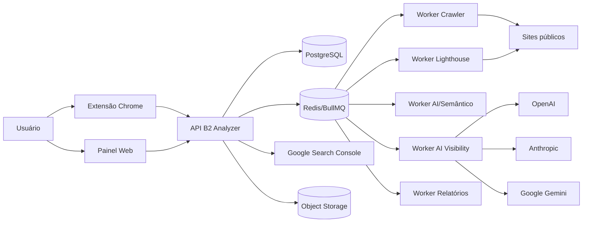
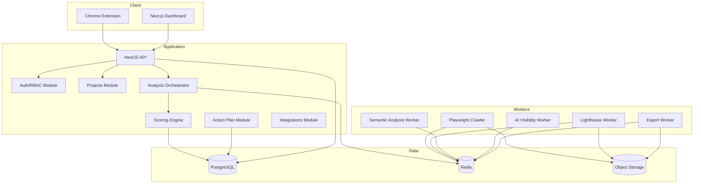
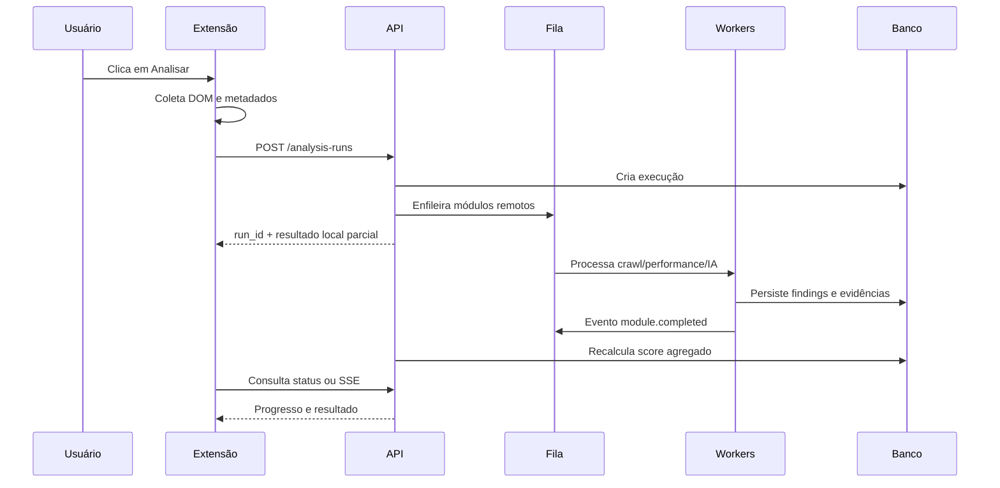

# 03 — Arquitetura do Sistema

## 1. Decisão arquitetural

A primeira versão será um **monólito modular orientado a eventos internos**, acompanhado de workers especializados. Essa abordagem reduz complexidade operacional no início e preserva a possibilidade de separar serviços no futuro.

Componentes com escalabilidade própria desde o início:

- API/painel;
- worker de crawl;
- worker Lighthouse;
- worker de análise semântica;
- worker de AI Visibility;
- worker de exportação.

## 2. Diagrama de contexto



## 3. Visão de containers



## 4. Fluxo de análise de página pela extensão



## 5. Fluxo de auditoria de domínio

1. validar domínio e autorização lógica do projeto;
2. resolver robots e sitemaps;
3. criar frontier de URLs;
4. normalizar URLs e aplicar escopo;
5. buscar páginas respeitando limite por host;
6. persistir snapshots e metadados;
7. executar regras por página;
8. construir grafo de links;
9. executar regras de domínio;
10. calcular scores;
11. gerar plano de ação;
12. notificar conclusão.

## 6. Módulos do backend

### 6.1 Identity & Access

- usuários;
- organizações;
- memberships;
- papéis;
- sessões;
- chaves e tokens de integração;
- auditoria.

### 6.2 Projects

- domínio principal;
- aliases;
- identidade da empresa;
- produtos, serviços e marcas;
- regiões;
- concorrentes;
- configurações de crawl;
- configurações de score.

### 6.3 Analysis Orchestrator

- criação da execução;
- seleção de módulos;
- dependências;
- idempotência;
- progresso;
- timeouts;
- retry;
- cancelamento;
- conclusão parcial.

### 6.4 Collectors

- extensão;
- HTTP;
- HTML source;
- DOM renderizado;
- robots;
- sitemap;
- network;
- Lighthouse;
- integrações;
- AI providers.

### 6.5 Rule Engine

- catálogo de regras;
- versão;
- pré-condições;
- avaliação;
- penalidade;
- caps;
- evidências;
- i18n;
- explicações.

### 6.6 Scoring Engine

- pesos por categoria;
- normalização;
- cobertura;
- confiança;
- score final;
- comparação histórica.

### 6.7 Semantic Analysis

- extração de empresa, oferta, região e aplicações;
- avaliação de completude;
- identificação de claims;
- relação claim-evidência;
- perguntas respondidas;
- lacunas;
- geração de sugestões.

### 6.8 Action Plan

- deduplicação de findings;
- criação de tarefas;
- prioridade;
- esforço;
- responsável;
- critério de aceite;
- fluxo de status.

### 6.9 Reports

- HTML imprimível;
- PDF;
- CSV;
- template white-label;
- links compartilháveis com expiração futura.

### 6.10 Integrations

- Search Console;
- Analytics em fase posterior;
- webhooks de saída;
- B2 Hub;
- provedores de IA.

## 7. Eventos internos

Padrão de nomes:

```text
analysis.run.created
analysis.module.started
analysis.module.completed
analysis.module.failed
analysis.run.scored
analysis.run.completed
analysis.run.cancelled
finding.created
action_item.created
integration.connected
integration.revoked
ai_visibility.prompt.completed
```

Todo evento deve conter:

- `event_id`;
- `event_type`;
- `occurred_at`;
- `tenant_id`;
- `correlation_id`;
- `analysis_run_id`, quando aplicável;
- versão do payload.

## 8. Filas

Filas sugeridas:

- `analysis-orchestration`;
- `crawl-page`;
- `crawl-domain`;
- `lighthouse`;
- `semantic-analysis`;
- `ai-visibility`;
- `report-export`;
- `integration-sync`;
- `notifications`;
- `dead-letter`.

Configurações:

- tentativas limitadas;
- backoff exponencial;
- timeout por tipo;
- prioridade por plano;
- concorrência por host;
- deduplicação por chave;
- dead-letter para análise manual.

## 9. Idempotência

Chaves de exemplo:

```text
page-analysis:{tenant}:{url_hash}:{snapshot_hash}:{ruleset_version}
lighthouse:{url_hash}:{device}:{config_version}
ai-visibility:{project}:{prompt_hash}:{provider}:{model}:{date_bucket}
```

Uma repetição deve retornar ou reutilizar resultado conforme política, sem duplicar cobrança indevida.

## 10. Snapshot e armazenamento

### Banco relacional

Armazena metadados, regras, findings, scores, ações e referências.

### Object storage

Armazena artefatos maiores:

- HTML original;
- DOM serializado;
- screenshot;
- relatório Lighthouse bruto;
- trace de rede reduzido;
- PDF exportado;
- respostas brutas de provedores quando permitido.

Os objetos devem usar URL assinada e chave contendo tenant e análise.

## 11. Contratos internos

Todos os analisadores retornam um contrato comum:

```ts
interface AnalyzerResult {
  analyzerKey: string;
  analyzerVersion: string;
  status: 'completed' | 'partial' | 'failed' | 'skipped';
  startedAt: string;
  completedAt: string;
  coverage: number;
  findings: FindingInput[];
  artifacts: ArtifactReference[];
  metrics: Record<string, number | string | boolean | null>;
  errors: AnalyzerError[];
}
```

## 12. Extensibilidade dos analisadores

Cada analisador implementa:

```ts
interface Analyzer<TInput = unknown> {
  key: string;
  version: string;
  supports(context: AnalysisContext): boolean;
  run(input: TInput, context: AnalysisContext): Promise<AnalyzerResult>;
}
```

As regras não devem depender diretamente de Playwright, Chrome ou APIs externas. Elas recebem fatos normalizados.

## 13. Facts layer

Antes das regras, os coletores produzem fatos padronizados:

```text
page.http.status
page.http.headers
page.meta.title
page.meta.description
page.meta.robots
page.canonical
page.headings
page.visible_text
page.links.internal
page.images
page.schemas
site.robots.rules
site.sitemaps
performance.lighthouse
entity.organization
entity.offers
content.claims
content.questions_answered
```

Benefícios:

- testes simples;
- reutilização;
- versionamento;
- menor acoplamento;
- comparação entre coleta local e remota.

## 14. Segurança arquitetural

- API não aceita acesso arbitrário à rede interna;
- crawler usa rede e identidade separadas;
- resolução DNS validada antes e durante redirects;
- egress controlado;
- segredos apenas no servidor;
- extensão nunca recebe chaves de provedores;
- tokens OAuth cifrados;
- consultas ao banco sempre filtradas por tenant;
- exports utilizam URLs temporárias;
- headers e cookies sensíveis são removidos de snapshots.

## 15. Evolução para serviços independentes

Separar um módulo quando pelo menos um critério ocorrer:

- demanda de escala muito diferente;
- dependência tecnológica incompatível;
- necessidade de deploy independente;
- requisito de isolamento de segurança;
- equipe responsável distinta;
- falhas do módulo comprometendo o restante.

Candidatos naturais:

- crawler;
- AI Visibility;
- geração de relatórios;
- integrações;
- scoring engine como serviço interno.

## 16. Ambientes

- `local`: Docker Compose e provedores simulados;
- `development`: ambiente compartilhado de desenvolvimento;
- `staging`: semelhante à produção, dados sintéticos;
- `production`: segregado, backups e monitoramento completos.

## 17. Configuração

Usar variáveis e serviço de segredos. Nunca versionar:

- chaves de API;
- credenciais OAuth;
- senhas;
- tokens;
- strings de conexão de produção;
- chaves de assinatura.

## 18. ADRs iniciais

- ADR-001: monólito modular + workers;
- ADR-002: TypeScript como linguagem principal;
- ADR-003: PostgreSQL como fonte de verdade;
- ADR-004: Redis/BullMQ para jobs;
- ADR-005: facts layer entre coleta e regras;
- ADR-006: versionamento imutável de rulesets;
- ADR-007: provedor de IA abstraído;
- ADR-008: snapshots grandes em object storage;
- ADR-009: extensão com permissões mínimas;
- ADR-010: AI Visibility separado de GEO Readiness.

