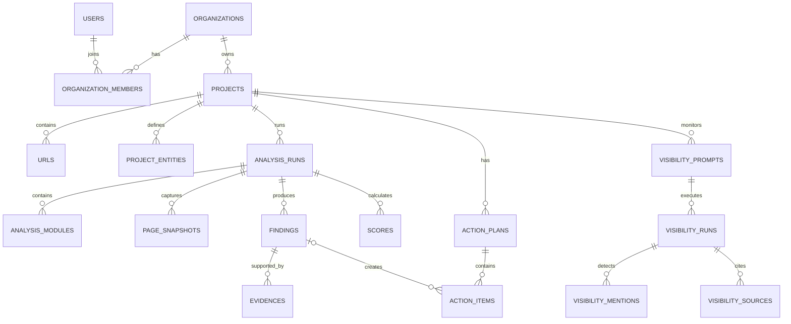

# 08 — Modelo de Dados

## 1. Princípios

- PostgreSQL como fonte de verdade;
- UUIDs;
- timestamps em UTC;
- soft delete somente onde necessário;
- imutabilidade de execuções e findings históricos;
- segregação por `organization_id`;
- JSONB para fatos flexíveis, sem substituir entidades relacionais centrais;
- arquivos grandes em object storage;
- versionamento de contratos.

## 2. Entidades principais

### 2.1 users

- id;
- email;
- name;
- status;
- locale;
- timezone;
- created_at;
- updated_at;
- last_login_at.

### 2.2 organizations

- id;
- name;
- slug;
- plan_key;
- status;
- brand_settings;
- data_region;
- created_at;
- updated_at.

### 2.3 organization_members

- organization_id;
- user_id;
- role;
- status;
- invited_by;
- joined_at.

Papéis iniciais:

- owner;
- admin;
- analyst;
- editor;
- viewer;
- billing.

### 2.4 projects

- id;
- organization_id;
- name;
- primary_domain;
- country_code;
- language_code;
- timezone;
- company_profile JSONB;
- crawl_settings JSONB;
- score_settings JSONB;
- status;
- created_at;
- updated_at.

### 2.5 project_entities

Representa marcas, produtos, serviços, regiões, setores, pessoas e concorrentes.

- id;
- project_id;
- type;
- name;
- normalized_name;
- aliases;
- metadata;
- is_confirmed;
- source;
- created_at.

### 2.6 urls

- id;
- project_id;
- normalized_url;
- url_hash;
- first_seen_at;
- last_seen_at;
- page_type;
- importance;
- status.

### 2.7 analysis_runs

- id;
- organization_id;
- project_id;
- url_id opcional;
- type: page, domain, ai_visibility, integration;
- source: extension, dashboard, schedule, api;
- status;
- requested_modules;
- completed_modules;
- ruleset_versions;
- progress;
- coverage;
- confidence;
- started_at;
- completed_at;
- created_by;
- correlation_id;
- error_summary.

### 2.8 analysis_modules

- id;
- analysis_run_id;
- module_key;
- module_version;
- status;
- coverage;
- started_at;
- completed_at;
- attempts;
- error_code;
- error_message;
- metrics JSONB.

### 2.9 page_snapshots

- id;
- analysis_run_id;
- url_id;
- capture_source;
- final_url;
- http_status;
- content_type;
- source_hash;
- rendered_hash;
- facts JSONB;
- source_artifact_id;
- rendered_artifact_id;
- screenshot_artifact_id;
- captured_at;
- expires_at.

### 2.10 artifacts

- id;
- organization_id;
- analysis_run_id;
- type;
- storage_key;
- content_type;
- size_bytes;
- checksum;
- encryption_state;
- retention_class;
- created_at;
- expires_at.

### 2.11 findings

- id;
- organization_id;
- project_id;
- analysis_run_id;
- url_id;
- rule_key;
- rule_version;
- score_type;
- category_key;
- status;
- severity;
- title;
- explanation;
- impact_text;
- remediation_text;
- acceptance_criteria;
- quality_ratio;
- points_available;
- points_earned;
- confidence;
- effort;
- priority;
- cause_group;
- data JSONB;
- created_at.

### 2.12 evidences

- id;
- finding_id;
- type;
- source;
- selector;
- excerpt;
- attribute_name;
- attribute_value;
- artifact_id;
- data JSONB;
- created_at.

### 2.13 scores

- id;
- analysis_run_id;
- score_type;
- ruleset_version;
- score;
- coverage;
- confidence;
- categories JSONB;
- gates JSONB;
- calculated_at.

### 2.14 action_plans

- id;
- project_id;
- source_analysis_run_id;
- name;
- status;
- generated_at;
- generated_by;
- settings JSONB.

### 2.15 action_items

- id;
- action_plan_id;
- finding_id opcional;
- title;
- description;
- discipline;
- priority;
- impact;
- effort;
- urgency;
- confidence;
- estimated_score_gain;
- owner_user_id;
- due_date;
- status;
- acceptance_criteria;
- source_type;
- manual_order;
- created_at;
- updated_at.

### 2.16 rulesets

- id;
- key;
- version;
- score_type;
- status;
- effective_at;
- definition JSONB;
- changelog;
- created_at.

### 2.17 rule_definitions

- id;
- ruleset_id;
- key;
- version;
- category_key;
- severity;
- max_points;
- evaluator;
- configuration JSONB;
- remediation_template;
- references JSONB.

### 2.18 integrations

- id;
- organization_id;
- provider;
- status;
- encrypted_credentials;
- scopes;
- metadata;
- connected_by;
- connected_at;
- expires_at;
- last_sync_at;
- error_state.

### 2.19 integration_bindings

- id;
- integration_id;
- project_id;
- external_resource_id;
- external_resource_name;
- settings;
- status.

### 2.20 visibility_prompts

- id;
- project_id;
- text;
- language;
- intent;
- topic;
- region;
- priority;
- source;
- version;
- active;
- created_at.

### 2.21 visibility_runs

- id;
- project_id;
- prompt_id;
- provider;
- model;
- configuration JSONB;
- status;
- executed_at;
- latency_ms;
- cost_amount;
- cost_currency;
- answer_artifact_id;
- normalized_response JSONB;
- confidence;
- error_code.

### 2.22 visibility_mentions

- id;
- visibility_run_id;
- entity_id;
- mention_type;
- matched_text;
- start_position;
- prominence;
- sentiment_context;
- accuracy_status;
- confidence;
- data JSONB.

### 2.23 visibility_sources

- id;
- visibility_run_id;
- domain;
- url;
- title;
- source_order;
- is_project_domain;
- data JSONB.

### 2.24 exports

- id;
- organization_id;
- project_id;
- analysis_run_id;
- type;
- status;
- artifact_id;
- requested_by;
- created_at;
- completed_at;
- expires_at.

### 2.25 audit_logs

- id;
- organization_id;
- actor_user_id;
- action;
- resource_type;
- resource_id;
- ip_hash;
- user_agent_summary;
- metadata;
- occurred_at.

### 2.26 usage_records

- id;
- organization_id;
- project_id;
- metric_key;
- quantity;
- unit;
- provider;
- cost_amount;
- occurred_at;
- idempotency_key.

## 3. Relacionamentos

## 4. Índices

Obrigatórios:

- todas as FKs;
- `projects(organization_id, status)`;
- `urls(project_id, url_hash)` unique;
- `analysis_runs(project_id, created_at desc)`;
- `analysis_runs(organization_id, status)`;
- `findings(analysis_run_id, severity, status)`;
- `findings(project_id, rule_key, created_at desc)`;
- `scores(analysis_run_id, score_type)` unique;
- `action_items(action_plan_id, status, priority)`;
- `visibility_runs(prompt_id, provider, executed_at desc)`;
- `audit_logs(organization_id, occurred_at desc)`;
- `usage_records(organization_id, occurred_at)`;
- GIN apenas para JSONB consultado com frequência.

## 5. Row-Level Security

Opção recomendada em produção: RLS no PostgreSQL como camada adicional, utilizando contexto de tenant por transação. Mesmo com RLS, a aplicação deve filtrar explicitamente por organização.

## 6. Retenção

Classes sugeridas:

- metadados de análise: enquanto projeto existir;
- snapshots HTML: 90 dias padrão;
- screenshots: 90 dias;
- relatórios exportados: 30 dias para link, regeneráveis;
- respostas brutas de IA: conforme termos/provedor e plano;
- logs operacionais: 30–90 dias;
- audit logs: 12–24 meses conforme plano e base legal;
- tokens revogados: remover imediatamente ou guardar hash mínimo para segurança.

## 7. Exclusão

Exclusão de projeto:

1. marcar como pending deletion;
2. revogar jobs e integrações;
3. excluir dados relacionais conforme dependências;
4. enfileirar expurgo de objetos;
5. manter apenas registros mínimos exigidos para faturamento/auditoria;
6. registrar conclusão.

## 8. Migrações

- ferramenta versionada;
- migrações forward e rollback quando possível;
- alterações destrutivas em duas etapas;
- backfill por job;
- feature flag para leitura/escrita nova;
- backup antes de mudanças críticas.

## 9. Dados sensíveis

- credenciais de integração cifradas por envelope encryption;
- e-mail e perfil protegidos;
- conteúdo de página pode conter informação confidencial quando análise local de área autenticada estiver habilitada;
- URLs podem conter parâmetros pessoais e devem ser sanitizadas;
- logs não devem conter payload bruto.

## 10. Critérios de aceite

- todas as tabelas tenant-aware possuem `organization_id` direto ou caminho inequívoco;
- constraints evitam duplicidade lógica;
- análise histórica imutável;
- regras e scores versionados;
- artefatos com checksum e expiração;
- exclusão propagada;
- índices validados por planos de consulta;
- schema migrável em ambiente limpo.

